# Akhand Sutra — Technical Overview

> *"The Unbroken Thread"* — A 2-player co-op action RPG built on Phaser 3.

---

## Table of Contents

1. [What Is This Game?](#1-what-is-this-game)
2. [Tech Stack](#2-tech-stack)
3. [Project Structure](#3-project-structure)
4. [Architecture Overview](#4-architecture-overview)
5. [Scene System](#5-scene-system)
6. [Entity System](#6-entity-system)
7. [Systems & Managers](#7-systems--managers)
8. [Data Layer](#8-data-layer)
9. [User Flow](#9-user-flow)
10. [Combat Flow](#10-combat-flow)
11. [Enemy AI](#11-enemy-ai)
12. [Boss System](#12-boss-system)
13. [Save & Persistence](#13-save--persistence)
14. [Multiplayer Networking](#14-multiplayer-networking)
15. [Map Editor](#15-map-editor)
16. [Key Design Decisions](#16-key-design-decisions)

---

## 1. What Is This Game?

Akhand Sutra is a top-down 2-player cooperative action RPG. Two warriors — Dhruva and Tara — travel through 7 mythological regions, battle 6 bosses, collect lore fragments, and ultimately choose how to end a cosmic conflict between unity and freedom. There are 3 possible endings, one of which requires collecting all 20 lore fragments.

| Dimension | Detail |
|---|---|
| Genre | Top-down action RPG |
| Players | 1-2 (local solo or online co-op) |
| Regions | 7 (tutorial → final fortress) |
| Bosses | 6 (each with 3 phases) |
| Endings | 3 (based on choice + lore collection) |
| World Size | 3200 × 2000 px |
| Viewport | 1280 × 720 px |

---

## 2. Tech Stack

| Layer | Technology | Purpose |
|---|---|---|
| Game Engine | **Phaser 3.60.0** (CDN) | Rendering, physics, input, animations |
| Server | **Node.js + ws 8.16.0** | Static file server + WebSocket multiplayer |
| Map Editor | **Konva.js** | Canvas-based map designer |
| Storage | **localStorage** | Save game progress |
| Audio | **Web Audio API** | Synthesized SFX + ambient tones |
| Testing | **Playwright** | End-to-end tests |
| Language | **ES Modules (vanilla JS)** | No bundler — modules loaded via `type="module"` |

**No build step.** The game runs directly from the file system via the Node.js dev server. Phaser is loaded from CDN; all game code is served as raw ES modules.

---

## 3. Project Structure

```
game/
├── index.html              ← Game entry point (loads Phaser CDN + main.js)
├── map_editor.html         ← Standalone collaborative map editor
├── asset_viewer.html       ← Asset browser tool
├── package.json            ← Server deps (ws, playwright)
├── server/
│   └── combined_server.js  ← Node.js HTTP + WebSocket server (port 8080)
├── src/
│   ├── main.js             ← Phaser game config + scene registration
│   ├── constants.js        ← All magic numbers (speeds, damage, sizes)
│   ├── scenes/
│   │   ├── PreloadScene.js     ← Asset loading + animation setup
│   │   ├── MainMenuScene.js    ← Start screen, settings, co-op entry
│   │   ├── PrologueScene.js    ← Narrative intro (7 fade-in lines)
│   │   ├── GameScene.js        ← Core gameplay (world, entities, loop)
│   │   ├── UIScene.js          ← Overlay HUD (HP, boss bar, quests)
│   │   ├── PauseScene.js       ← Pause menu
│   │   └── GameEndingScene.js  ← 3-choice ending + epilogue
│   ├── entities/
│   │   ├── Player.js       ← Dhruva / Tara (input, combat, dodge)
│   │   ├── Enemy.js        ← AI monsters (state machine)
│   │   ├── Boss.js         ← Phase bosses (posture, patterns)
│   │   ├── NPC.js          ← Quest-giving characters
│   │   └── Projectile.js   ← Arrows, orbs, boss attacks
│   ├── systems/
│   │   ├── AbilityManager.js   ← 6 abilities (3 per character)
│   │   ├── AudioManager.js     ← Synthesized audio (Web Audio API)
│   │   ├── LoreManager.js      ← Fragment collection + true ending gate
│   │   ├── NetworkManager.js   ← WebSocket co-op client
│   │   ├── QuestManager.js     ← Quest state + kill tracking
│   │   ├── SaveManager.js      ← localStorage persistence
│   │   └── QualitySettings.js  ← Performance tiers (low/med/high)
│   └── data/
│       ├── regions.js      ← 7 region configs (layout, enemies, portals)
│       ├── enemies.js      ← 5 enemy type stats
│       ├── bosses.js       ← 6 boss configs with phase data
│       └── quests.js       ← Quests, NPC dialogue, lore fragments
└── docs/
    ├── GAME_DESIGN_DOCUMENT.md
    └── TECHNICAL_OVERVIEW.md   ← (this file)
```

---

## 4. Architecture Overview

```mermaid
graph TB
    subgraph Browser
        PH[Phaser 3 Engine]
        subgraph Scenes
            PRE[PreloadScene]
            MM[MainMenuScene]
            PRO[PrologueScene]
            GS[GameScene]
            UI[UIScene]
            PS[PauseScene]
            END[GameEndingScene]
        end
        subgraph Entities
            PL[Player]
            EN[Enemy]
            BO[Boss]
            NP[NPC]
            PR[Projectile]
        end
        subgraph Systems
            AB[AbilityManager]
            AU[AudioManager]
            LO[LoreManager]
            NM[NetworkManager]
            QM[QuestManager]
            SM[SaveManager]
            QS[QualitySettings]
        end
        subgraph Data
            RD[regions.js]
            ED[enemies.js]
            BD[bosses.js]
            QD[quests.js]
        end
        LS[(localStorage)]
    end

    subgraph Server["Node.js Server :8080"]
        HTTP[HTTP Static Files]
        WS[WebSocket Rooms]
        API[/api/assets]
    end

    PH --> Scenes
    GS --> Entities
    GS --> Systems
    Systems --> Data
    SM --> LS
    NM <-->|ws://| WS
    MM -->|fetch| API
```

**How the layers connect:**

- **Phaser** owns the render loop and input. All scenes extend `Phaser.Scene`.
- **GameScene** is the orchestrator — it instantiates all entities and systems, runs the update loop, and emits events.
- **UIScene** runs in parallel as a Phaser overlay scene. It listens to events emitted by GameScene and updates the HUD.
- **Systems** are plain JS classes (no Phaser dependency) except AudioManager (Web Audio API) and NetworkManager (WebSocket).
- **Data files** are static JS objects — no API calls during gameplay.
- **SaveManager** is the only piece that talks to localStorage.

---

## 5. Scene System

### Scene Lifecycle

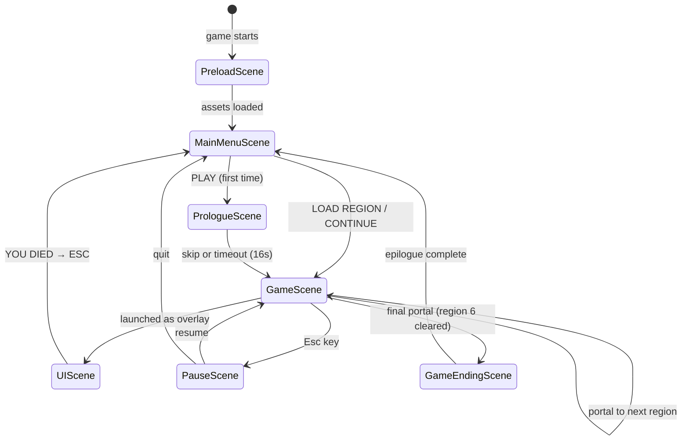

### Scene Relationships

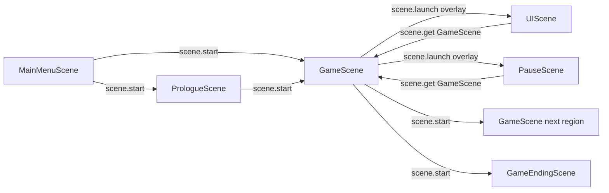

UIScene and PauseScene are **overlay scenes** — they render on top of GameScene without stopping it. GameScene can be restarted with new `regionIndex` data to load the next region without rebuilding the engine.

### Scenes at a Glance

| Scene | Role | Key Methods |
|---|---|---|
| **PreloadScene** | Load all PNG spritesheets, define all animations | `preload()`, `create()` |
| **MainMenuScene** | Start screen, settings, co-op lobby | `create()`, `update()` |
| **PrologueScene** | 7-line narrative intro → title → fade | `create()` |
| **GameScene** | World, entities, input, quests, saves | `create()`, `update()` (1382 lines) |
| **UIScene** | HP bars, boss bar, toasts, quest log | `create()`, `update()` |
| **PauseScene** | Pause menu overlay | `create()` |
| **GameEndingScene** | 3-choice ending + epilogue text | `create()` |

---

## 6. Entity System

### Hierarchy

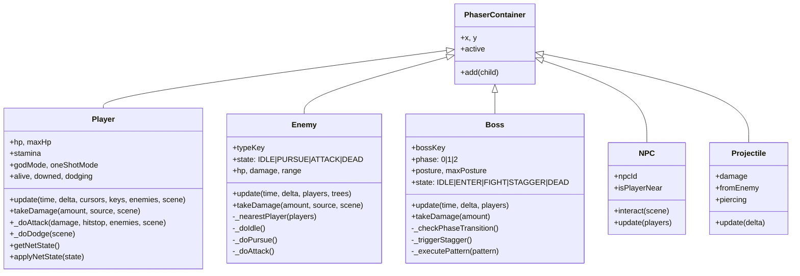

### Entity Interactions

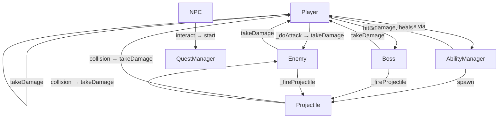

---

## 7. Systems & Managers

### Systems Overview

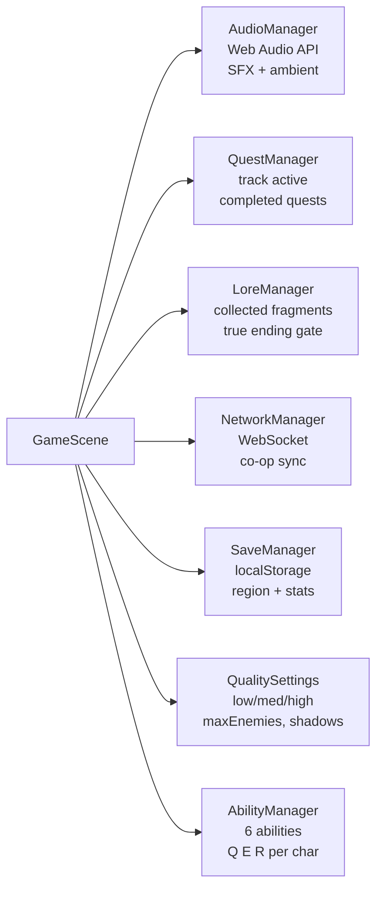

### AbilityManager

Manages 6 abilities — 3 per character. Each ability is a pure JS object with stamina cost, cooldown, and an `execute(player, scene)` function.

| Character | Key | Ability | Effect |
|---|---|---|---|
| Dhruva | Q | Prithvi Slam | AoE 150px, 80 dmg |
| Dhruva | E | Agni Shield | 3s damage reduction + reflect |
| Dhruva | R | Agni Burst | AoE 250px, 120 dmg + knockback |
| Tara | Q | Vayu Dash | Teleport 300px + 50 dmg slash |
| Tara | E | Jal Mend | Heal both players +60 HP |
| Tara | R | Vayu Storm | Chain lightning (3 enemies) |

### AudioManager

All audio is synthesized via the Web Audio API — no audio files. Each sound is built from oscillators (`OscillatorNode`) and white noise buffers.

```
audio.hit()          → 220Hz sawtooth burst + noise
audio.dodge()        → 600/900Hz sine pair
audio.perfectDodge() → 880/1100/1320Hz triad (ascending)
audio.ability()      → 440/660Hz square chord
audio.bossPhase()    → 200→400Hz sawtooth sweep
audio.startAmbient(regionIndex) → per-region drone tone
```

### QuestManager

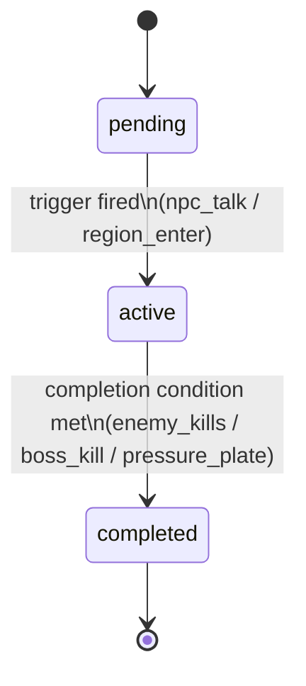

### SaveManager

Saves to `localStorage` key `akhand_sutra_save` as JSON:

```json
{
  "regionIndex": 3,
  "playerStats": { "maxHp": 200, "maxStamina": 100, "abilityPow": 1.0 },
  "completedQuests": ["gramavana_main", "mahavana_sq1"],
  "inventory": [],
  "collectedLoreIds": ["lore_001", "lore_002"],
  "bossKills": ["nagraj_kaliya"]
}
```

Saves happen on **portal use only** — there is no mid-region autosave.

---

## 8. Data Layer

All game content lives in static JS data files. No database, no API calls during gameplay.

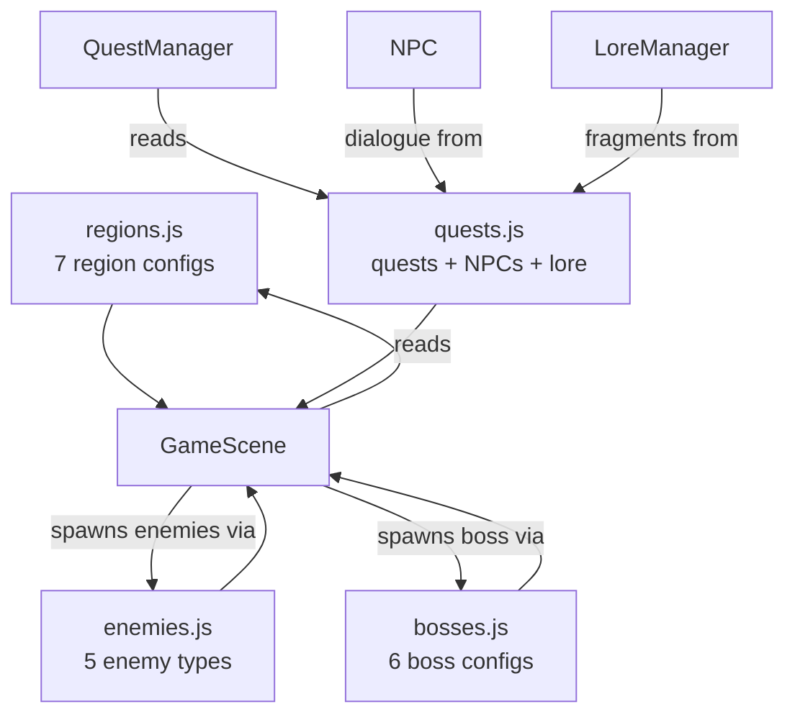

### Region Config Shape

Each region defines the full world for that level:

```javascript
{
  index: 3,
  name: "Nāga Pātāl",
  subtitle: "The Serpent Realm",
  bgColor: 0x3a1a00,
  difficulty: 1.2,          // scales enemy HP and damage
  bossKey: "nagraj_kaliya",
  spawnPos: { x: 200, y: 1000 },
  bossPos: { x: 2800, y: 1000 },
  portalBack: { x: 120, y: 1000 },
  portalNext: { x: 3080, y: 1000 },
  enemySpawnMode: "spawner", // or "fixed"
  enemyTypes: ["melee", "orc", "elite"],
  portalUnlock: "boss_kill", // gate condition for next portal
  worldFragments: [ { fragmentId: "lore_009", x: 600, y: 800 } ],
  serpentRealm: true,        // visual style flag
}
```

### Enemy Types

| Key | Sprite | HP | Speed | Dmg | Range |
|---|---|---|---|---|---|
| `melee` | Goblin | 80 | 120 | 15 | 60px |
| `ranged` | Archer | 55 | 90 | 12 | 350px |
| `flying` | Lancer | 65 | 135 | 18 | 80px |
| `orc` | Orc | 130 | 105 | 22 | 65px |
| `elite` | Ogre | 200 | 90 | 32 | 75px |

All stats are multiplied by the region's `difficulty` value at spawn.

### Boss Configs

Each boss has 3 phases with escalating stats and attack patterns:

```javascript
vanaraksha: {
  maxHp: 1200,
  maxPosture: 400,
  phases: [
    { hpThreshold: 1.0, speed: 80,  attackCd: 2000, patterns: ["slam", "root"] },
    { hpThreshold: 0.5, speed: 110, attackCd: 1600, patterns: ["slam", "root", "spore_burst"] },
    { hpThreshold: 0.3, speed: 140, attackCd: 1200, patterns: ["slam", "root", "spore_burst", "rage_slam"] },
  ]
}
```

---

## 9. User Flow

### Full Game Flow

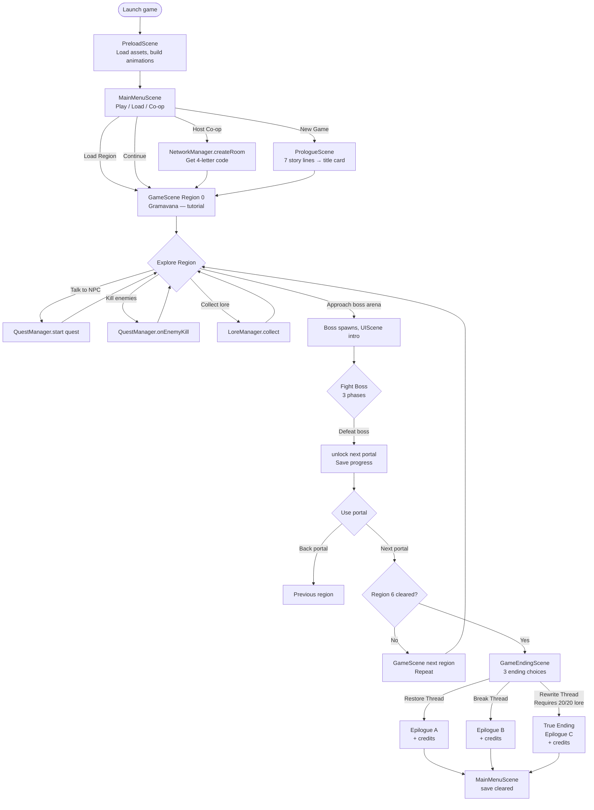

### Death Flow

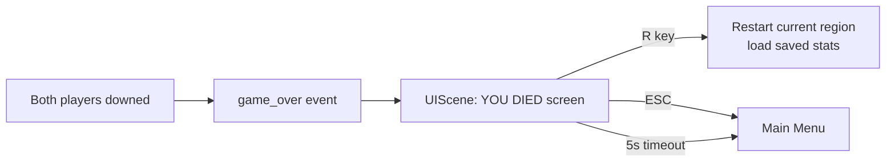

---

## 10. Combat Flow

### Player Attack

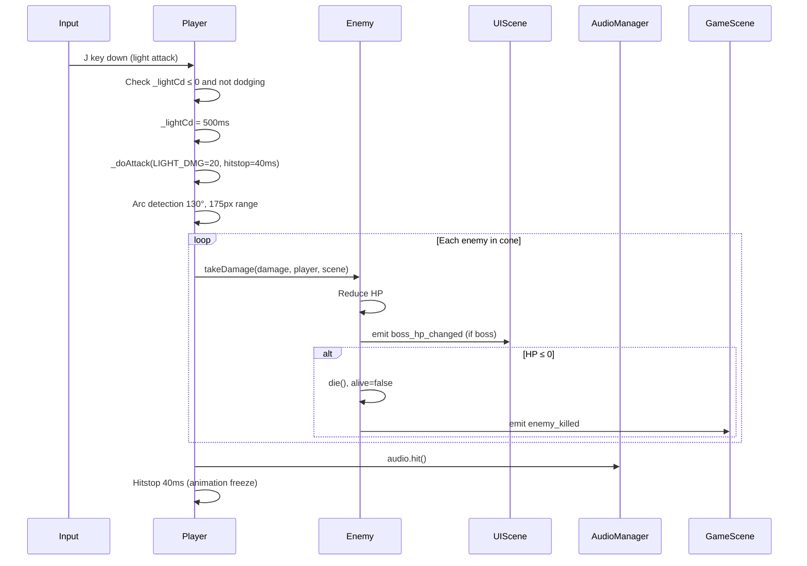

### Dodge + Perfect Dodge

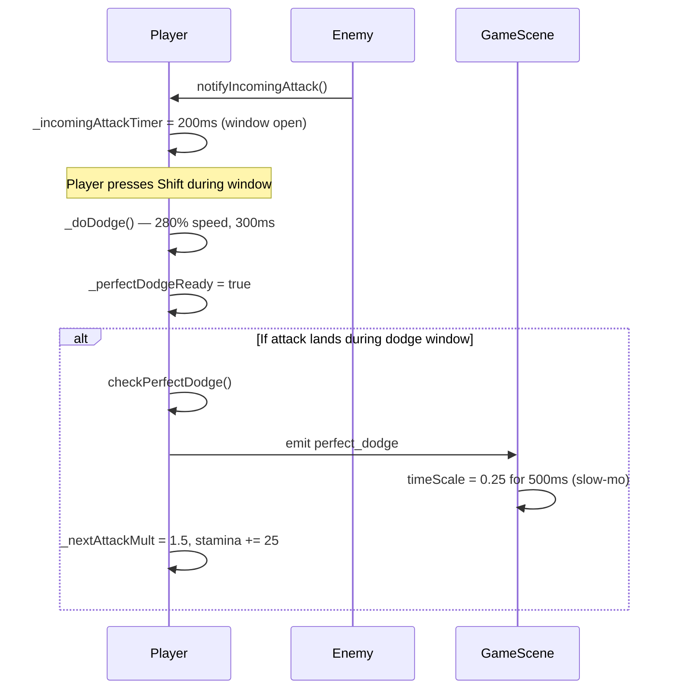

---

## 11. Enemy AI

### State Machine

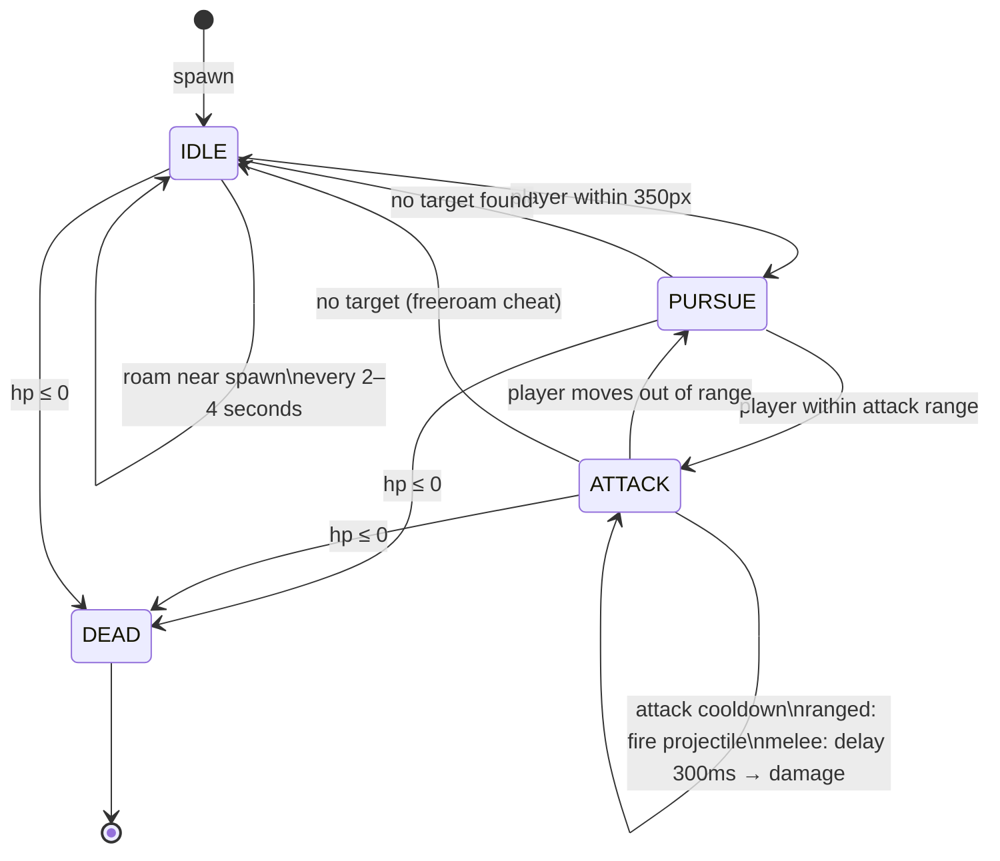

### Ranged Enemy Cover Logic

Ranged enemies (Archers) use a cover system: when >200px from the target, they evaluate nearby tree positions and move toward the one with the best score (`-distanceToTree + bonus if tree has line-of-sight to target`). This means archers strafe sideways to hide behind trees before firing.

---

## 12. Boss System

### Boss State Machine

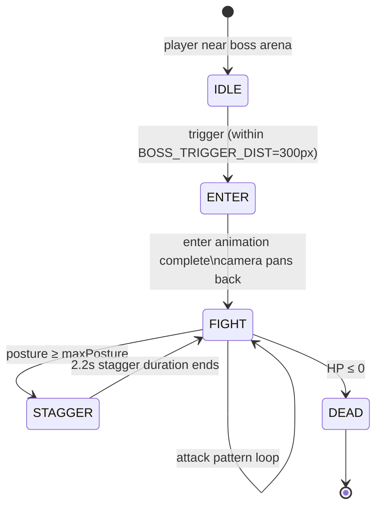

### Phase Transitions

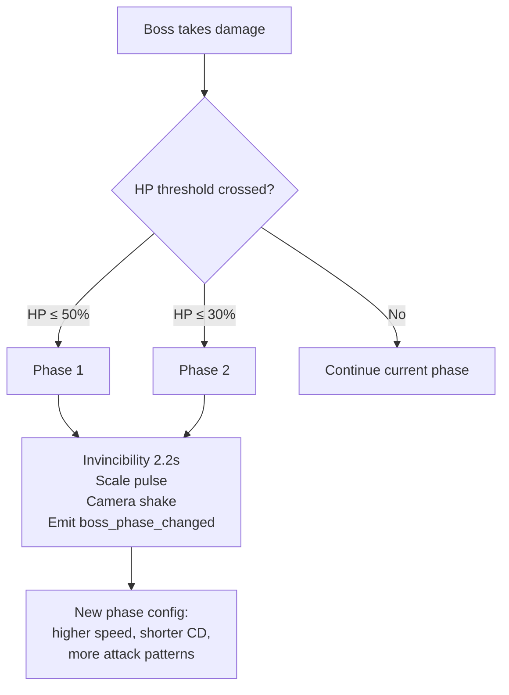

### Posture System

The posture bar is a secondary damage meter — dealing damage also fills the posture bar at a rate of `damage × 0.4`. When the posture bar fills completely, the boss staggers for 2.2 seconds (fully immobile, vulnerable to all damage). This creates a rhythm: build posture between attacks, burst damage during stagger.

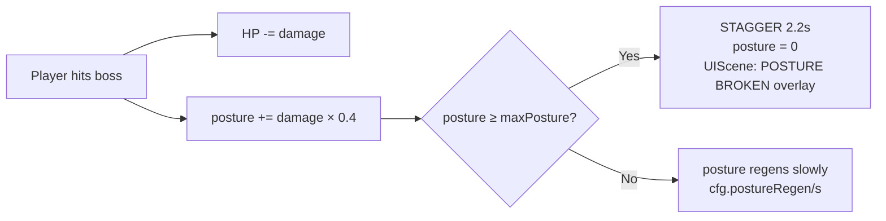

---

## 13. Save & Persistence

### Save Trigger Points

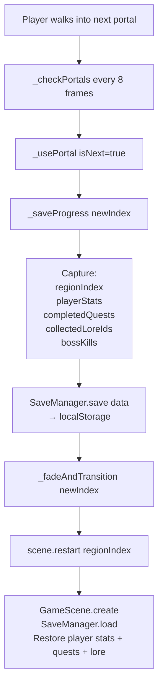

### What Is Saved vs. What Is Not

| Saved | Not Saved |
|---|---|
| Region index | Mid-region enemy positions |
| Player HP/stamina/ability power | Loot on the ground |
| Completed quest IDs | NPC interaction state per session |
| Collected lore fragment IDs | Current enemy wave state |
| Boss kill list | |

---

## 14. Multiplayer Networking

### Connection Flow

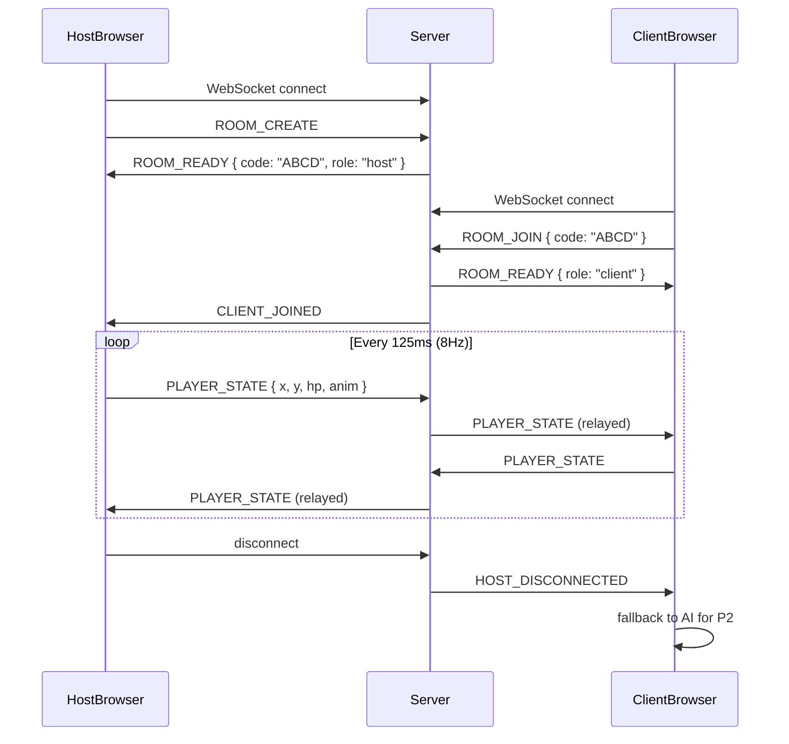

### Sync Model

- **P1 (local) + P2 (remote)**: Each player controls their own character; only position, HP, and animation state are synced.
- **8Hz broadcast** (125ms tick): Low bandwidth trade-off; acceptable for cooperative (non-competitive) play.
- **No server-side simulation**: The server is a relay only — no game logic runs on the server.
- **Fallback**: If the remote peer disconnects, P2 reverts to AI-controlled follow behavior.

---

## 15. Map Editor

The map editor (`map_editor.html`) is a standalone tool separate from the game. It uses **Konva.js** for the canvas layer and connects to the same Node.js WebSocket server for real-time collaboration.

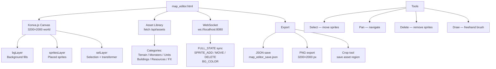

### Asset API

The server exposes `GET /api/assets` which scans the asset directories and returns a categorized manifest. The map editor uses this to populate its asset library — no hardcoded asset lists.

---

## 16. Key Design Decisions

### Why Phaser 3 (not Unity/Godot)?

Phaser runs in the browser with zero install. Co-op over WebSocket works without a launcher, matchmaking service, or NAT traversal — players share a URL and a 4-letter room code.

### Why No Build Step?

ES modules are loaded directly. This keeps the dev loop instant: edit a file, refresh the browser. No webpack, no transpilation, no hot-reload server. The trade-off is no TypeScript and slightly slower cold load (many small module fetches), both acceptable for a game this size.

### Why Synthesized Audio?

Web Audio API synthesis means zero audio asset files, no licensing concerns, and audio that can dynamically pitch/speed based on game state. The trade-off is that the sounds are abstract (beeps, sweeps) rather than realistic.

### Why localStorage for Saves?

Simple, zero-dependency, works offline. The save payload is small (<2KB). The trade-off is save data is per-browser, not per-account.

### Posture System

Inspired by Sekiro's stamina meter. It prevents degenerate strategies (spam attacks → free stagger) because posture regens between bursts. Players must coordinate burst windows during the 2.2s stagger, which rewards co-op coordination.

### Poisson-Disk Tree Placement

Trees are placed using Poisson-disk sampling with a seeded deterministic RNG. This ensures forest areas look organic (not grid-like, not random clumps) and always generate identically. Exclusion zones around portals, boss arenas, and NPC positions are respected.

### 8Hz Network Tick

Co-op is cooperative, not competitive — players don't need frame-perfect sync. 125ms latency is imperceptible for "follow your friend" play. Higher tick rates would multiply bandwidth usage for no perceptible benefit.

---

## Summary — How Everything Connects

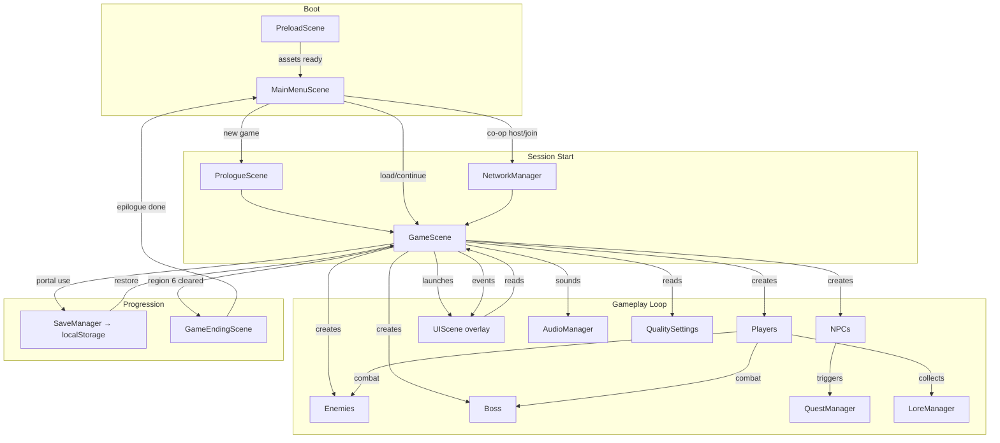

The game is a **single main loop** (GameScene) surrounded by **stateless data** (regions/enemies/bosses/quests), **event-driven UI** (UIScene listening on GameScene's event emitter), and **side-effect managers** (save, audio, network, quests) that the GameScene calls in response to gameplay events.
