# Akhand Sutra — Technical Overview

> *"The Unbroken Thread"* — A 1–2 player co-op action RPG built on Phaser 3.

---

## Table of Contents

1. [What Is This Game?](#1-what-is-this-game)
2. [Tech Stack](#2-tech-stack)
3. [Project Structure](#3-project-structure)
4. [Architecture Overview](#4-architecture-overview)
5. [Scene System](#5-scene-system)
6. [Entity System](#6-entity-system)
7. [Systems & Managers](#7-systems--managers)
8. [Data Layer](#8-data-layer)
9. [Seamless Region Streaming](#9-seamless-region-streaming)
10. [Prop & Collision System](#10-prop--collision-system)
11. [Creature System](#11-creature-system)
12. [XP, Leveling & Amrit](#12-xp-leveling--amrit)
13. [Death Echo](#13-death-echo)
14. [World Map & Fog-of-War](#14-world-map--fog-of-war)
15. [User Flow](#15-user-flow)
16. [Combat Flow](#16-combat-flow)
17. [Enemy AI](#17-enemy-ai)
18. [Boss System](#18-boss-system)
19. [Save & Persistence](#19-save--persistence)
20. [Multiplayer Networking](#20-multiplayer-networking)
21. [Map Editor](#21-map-editor)
22. [Key Design Decisions](#22-key-design-decisions)

---

## 1. What Is This Game?

Akhand Sutra is a top-down 1–2 player cooperative action RPG. Two warriors — Dhruva and Tara — travel through a 50-region open world across 7 mythological Acts, battle bosses, collect lore fragments, and choose how to end a cosmic conflict. The world streams seamlessly: there are no loading screens between adjacent regions.

| Dimension | Detail |
|---|---|
| Genre | Top-down action RPG / open world |
| Players | 1–2 (local solo or online co-op) |
| Regions | 50 authored (0, 7–49) + 6 legacy narrative descriptors (1–6) |
| Acts | 7 (Earth → Water → Fire → Wind → Underworld → Void → Secret) |
| Bosses | 4+ named bosses (each with 3 phases) + map-editor mini-bosses |
| Endings | 3 (based on player choice + lore collection) |
| Per-Region Size | 3200 × 2000 px |
| Viewport | 1280 × 720 px |

---

## 2. Tech Stack

| Layer | Technology | Purpose |
|---|---|---|
| Game Engine | **Phaser 3.60.0** (CDN) | Rendering, physics (Arcade), input, animations |
| Server | **Node.js + ws 8.16.0** | Static file server + WebSocket multiplayer |
| Map Editor | **Konva.js** | Canvas-based map designer |
| Storage | **localStorage** | Save game + explored-region fog-of-war |
| Audio | **Web Audio API** | Synthesized SFX + ambient tones (no audio files) |
| Testing | **Playwright** | End-to-end tests |
| Language | **ES Modules (vanilla JS)** | No bundler — modules loaded via `type="module"` |

**No build step.** The game runs directly from the file system via the Node.js dev server. Phaser is loaded from CDN; all game code is served as raw ES modules.

---

## 3. Project Structure

```
game/
├── index.html                  ← Game entry point
├── map_editor.html             ← Standalone collaborative map editor
├── asset_viewer.html           ← Asset browser tool
├── animation_reviewer.html     ← Animation review and approve tool
├── package.json                ← Server deps (ws, playwright)
├── regions/                    ← 50 map-editor authored region JSONs (region_0, 7–49)
├── server/
│   └── combined_server.js      ← Node.js HTTP + WebSocket server (port 8080)
├── src/
│   ├── main.js                 ← Phaser game config + scene registration
│   ├── constants.js            ← Magic numbers (speeds, damage, XP thresholds, items)
│   ├── scenes/
│   │   ├── PreloadScene.js         ← Asset loading + animation setup
│   │   ├── MainMenuScene.js        ← Start screen, settings, co-op entry
│   │   ├── PrologueScene.js        ← Narrative intro (7 fade-in lines)
│   │   ├── GameScene.js            ← Core gameplay (~3352 lines)
│   │   ├── UIScene.js              ← Overlay HUD (HP, boss bar, Amrit pips, quests)
│   │   ├── PauseScene.js           ← Pause menu
│   │   ├── WorldMapScene.js        ← Pannable world map with fog-of-war (~594 lines)
│   │   ├── ShrineScene.js          ← Level-up stat allocation at Thread Shrines
│   │   └── GameEndingScene.js      ← 3-choice ending + epilogue
│   ├── entities/
│   │   ├── Player.js           ← Dhruva / Tara (input, combat, Amrit, XP, dodge)
│   │   ├── Enemy.js            ← AI monsters (state machine)
│   │   ├── Boss.js             ← Phase bosses (posture, patterns)
│   │   ├── NPC.js              ← Quest-giving characters
│   │   └── Projectile.js       ← Arrows, orbs, boss attacks
│   ├── systems/
│   │   ├── AbilityManager.js   ← 6 abilities (3 per character)
│   │   ├── AnimationLoader.js  ← Generic runtime loader (legacy bosses + JSON entities)
│   │   ├── AudioManager.js     ← Synthesized audio (Web Audio API)
│   │   ├── ExploredManager.js  ← Fog-of-war: tracks visited region indices
│   │   ├── LoreManager.js      ← Fragment collection + true ending gate
│   │   ├── NetworkManager.js   ← WebSocket co-op client
│   │   ├── QuestManager.js     ← Quest state + kill tracking
│   │   ├── QualitySettings.js  ← Performance tiers (low/med/high)
│   │   └── SaveManager.js      ← localStorage persistence
│   └── data/
│       ├── bossAssets.js       ← Legacy boss animation family specs
│       ├── bosses.js           ← Named boss configs with phase data
│       ├── codex.js            ← Bestiary lore text + character/NPC entries
│       ├── creatureStats.js    ← Per-entity stats for map-editor creatures
│       ├── enemies.js          ← 8 built-in enemy type definitions
│       ├── propFootprints.js   ← Auto-generated collision footprints per asset
│       ├── propTypes.js        ← Prop classification (solid/decor/ground)
│       ├── quests.js           ← Quests, NPC dialogue, lore fragments
│       ├── regions.js          ← 7 narrative region descriptors
│       └── worldMapLayout.js   ← Node positions + act colours for WorldMapScene
└── docs/
    ├── GAME_DESIGN_DOCUMENT.md
    ├── TECHNICAL_OVERVIEW.md   ← (this file)
    ├── WORLD_MAP_DESIGN.md
    ├── ANIMATION_PIPELINE.md
    └── ASSETS.md
```

---

## 4. Architecture Overview

```mermaid
graph TB
    subgraph Browser
        PH[Phaser 3 Engine]
        subgraph Scenes
            PRE[PreloadScene]
            MM[MainMenuScene]
            PRO[PrologueScene]
            GS[GameScene]
            UI[UIScene]
            WM[WorldMapScene]
            SH[ShrineScene]
            PS[PauseScene]
            END[GameEndingScene]
        end
        subgraph Entities
            PL[Player]
            EN[Enemy]
            BO[Boss]
            NP[NPC]
            PR[Projectile]
        end
        subgraph Systems
            AB[AbilityManager]
            AL[AnimationLoader]
            AU[AudioManager]
            EX[ExploredManager]
            LO[LoreManager]
            NM[NetworkManager]
            QM[QuestManager]
            SM[SaveManager]
            QS[QualitySettings]
        end
        subgraph Data
            RD[regions.js]
            ED[enemies.js]
            BD[bosses.js]
            QD[quests.js]
            CD[codex.js]
            CS[creatureStats.js]
            PT[propTypes.js]
            PF[propFootprints.js]
            WL[worldMapLayout.js]
        end
        LS[(localStorage)]
    end

    subgraph Server["Node.js Server :8080"]
        HTTP[HTTP Static Files]
        WS[WebSocket Rooms]
        API[/api/assets, /api/regions]
    end

    PH --> Scenes
    GS --> Entities
    GS --> Systems
    GS -->|streaming| regions[(regions/*.json)]
    Systems --> Data
    SM --> LS
    EX --> LS
    NM <-->|ws://| WS
    WM -->|fetch| API
```

**How the layers connect:**

- **Phaser** owns the render loop and input. All scenes extend `Phaser.Scene`.
- **GameScene** (~3352 lines) is the orchestrator — instantiates entities, systems, streaming, echo triggers, world fragments, and the prop/collision system.
- **UIScene** runs as a Phaser overlay scene, listening to events from GameScene to update the HUD.
- **WorldMapScene** is a full-screen overlay launched from the menu or M key; it fetches region data from `/api/regions` and uses `ExploredManager` for fog-of-war.
- **Systems** are plain JS classes (no Phaser dependency) except AudioManager (Web Audio API) and NetworkManager (WebSocket).
- **Data files** are static JS objects — no API calls during gameplay.

---

## 5. Scene System

### Scene Lifecycle

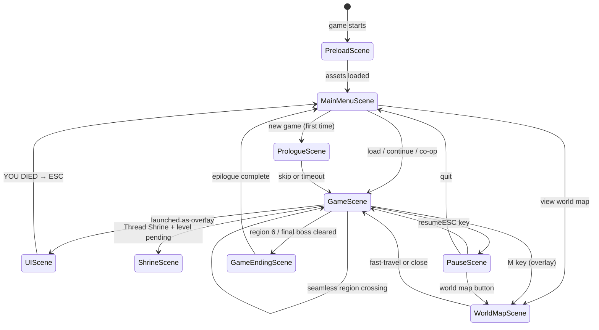

### Scenes at a Glance

| Scene | Role | Key Methods |
|---|---|---|
| **PreloadScene** | Load all PNG spritesheets, parse animations.json, define animations | `preload()`, `create()` |
| **MainMenuScene** | Start screen, settings, co-op lobby | `create()`, `update()` |
| **PrologueScene** | 7-line narrative intro → title → fade | `create()` |
| **GameScene** | World, streaming, entities, input, quests, saves | `create()`, `update()` (~3352 lines) |
| **UIScene** | HP bars, Amrit pips, boss bar, toasts, quest log | `create()`, `update()` |
| **WorldMapScene** | Pannable 50-node map, fog-of-war, fast travel | `create()` (~594 lines) |
| **ShrineScene** | Stat point allocation on level-up | `create()` |
| **PauseScene** | Pause menu overlay | `create()` |
| **GameEndingScene** | 3-choice ending + epilogue text | `create()` |

---

## 6. Entity System

### Entity Interactions

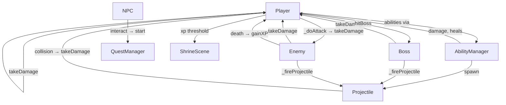

---

## 7. Systems & Managers

### Systems Overview

| System | Purpose | Dependencies |
|---|---|---|
| **AbilityManager** | 6 abilities (Q/E/R × 2 chars); each is a stamina+cooldown+execute object | Phaser physics, Player |
| **AnimationLoader** | Runtime animation loader for boss specs + approved `animations.json` entities | Phaser loader, bossAssets.js |
| **AudioManager** | Synthesized SFX + ambient drone via Web Audio API; no audio files | Web Audio API |
| **ExploredManager** | Fog-of-war: tracks visited region indices in localStorage | localStorage |
| **LoreManager** | Tracks collected lore fragment IDs; gates true ending at 15 fragments | quests.js |
| **NetworkManager** | WebSocket co-op client; 8Hz state broadcast | ws server |
| **QuestManager** | Quest state machine (not_started → active → completed) + kill counting | quests.js |
| **QualitySettings** | Low/med/high presets for shadow, occlusion, max enemies | localStorage |
| **SaveManager** | Full game state (XP, Amrit, quests, lore, region) → localStorage | localStorage |

### AbilityManager

Manages 6 abilities — 3 per character. Each ability is a pure JS object with stamina cost, cooldown, and an `execute(player, scene)` function.

| Character | Key | Ability | Effect |
|---|---|---|---|
| Dhruva | Q | Prithvi Slam | AoE 150px, 80 dmg |
| Dhruva | E | Agni Shield | 3s damage reduction + reflect |
| Dhruva | R | Agni Burst | AoE 250px, 120 dmg + knockback |
| Tara | Q | Vayu Dash | Teleport 300px + 50 dmg slash |
| Tara | E | Jal Mend | Heal both players +60 HP |
| Tara | R | Vayu Storm | Chain lightning (3 enemies) |

### AudioManager

All audio synthesized via Web Audio API — no audio files.

```
audio.hit()            → 220Hz sawtooth burst + noise
audio.dodge()          → 600/900Hz sine pair
audio.perfectDodge()   → 880/1100/1320Hz triad (ascending)
audio.ability()        → 440/660Hz square chord
audio.bossPhase()      → 200→400Hz sawtooth sweep
audio.startAmbient(n)  → per-region drone tone (40–80 Hz)
```

### ExploredManager

```javascript
// Static class; persists to localStorage key 'akhand_explored'
ExploredManager.markExplored(regionIndex)  // call on GameScene.create()
ExploredManager.isExplored(regionIndex)    // used by WorldMapScene for fog
ExploredManager.getAll()                   // → Set<number>
```

### SaveManager

Saves to `localStorage` key `akhand_sutra_save` as JSON:

```json
{
  "regionIndex": 3,
  "playerStats": { "maxHp": 200, "maxStamina": 100, "abilityPow": 1.0 },
  "playerXP": 450,
  "amritCharges": 3,
  "amritMax": 4,
  "pendingLevels": 1,
  "completedQuests": ["gramavana_main", "mahavana_sq1"],
  "inventory": ["forest_totem"],
  "collectedLoreIds": ["lore_001", "lore_002"],
  "bossKills": ["nagraj_kaliya"],
  "encounteredEnemyIds": ["melee", "ranged", "bat"],
  "metNpcs": [{ "id": "elder_mahesh", "name": "Elder Mahesh" }]
}
```

Saves happen on **portal use** and **Thread Shrine interaction**.

---

## 8. Data Layer

All game content lives in static JS data files. No database, no API calls during gameplay.

### Region Config Shape (narrative REGIONS[])

Each of the 7 narrative regions defines gameplay metadata:

```javascript
{
  index: 3,
  name: "Nāga Pātāl",
  subtitle: "The Serpent Realm",
  bgColor: 0x8b5a1a,
  difficulty: 1.8,
  bossKey: 'nagraj_kaliya',
  spawnPos: { x: 380, y: 1000 },
  bossPos:  { x: 2800, y: 1000 },
  portalBack: { x: 120, y: 1000 },
  portalNext: { x: 3080, y: 1000 },
  enemySpawnMode: 'spawner',
  fixedEnemies: [...],
  spawnerPositions: [...],
  platePositions: [...],
  enemyTypes: ['orc', 'ranged', 'flying', 'bat', 'slimem'],
  echoTriggers: [
    { id: 'echo_nagapatal_prison', x: 1700, y: 1000, r: 200,
      text: '⟨Sealed Prison Echo⟩ "..."' }
  ],
  worldFragments: [
    { fragmentId: 'lore_drowned_reliquary', x: 1700, y: 800 }
  ],
  ambientKey: 3,
}
```

### Map-Editor Region JSON Shape (`regions/region_N.json`)

```json
{
  "regionName": "Ash Village",
  "regionSubtitle": "Gramavana",
  "version": 1,
  "background": { "type": "color", "value": "#2d5c28" },
  "sprites": [
    {
      "type": "sprite",
      "spriteId": "s_...",
      "dir": "Tiny Swords (Free Pack)/...",
      "frames": ["Rock4.png"],
      "name": "Rock4",
      "spriteLayer": "below",
      "x": 3060, "y": 800, "scale": 2.5, "tint": null
    }
  ],
  "noWalkZones": [ { "x": 100, "y": 100, "w": 200, "h": 50 } ],
  "enemies": [ { "type": "melee", "x": 1500, "y": 800 } ],
  "boss": null,
  "regionIndex": 0,
  "portals": {
    "back": { "x": 120, "y": 1000, "targetRegion": null },
    "next": { "x": 3080, "y": 1000, "targetRegion": 7 }
  }
}
```

### Enemy Types

| Key | Sprite | HP | Speed | Dmg | Range |
|---|---|---|---|---|---|
| `melee` | Goblin | 80 | 120 | 15 | 60px |
| `ranged` | Archer | 55 | 90 | 12 | 350px |
| `flying` | Lancer | 65 | 135 | 18 | 80px |
| `orc` | Orc | 130 | 105 | 22 | 65px |
| `elite` | Ogre | 200 | 90 | 32 | 75px |
| `bat` | Bat | 45 | 155 | 11 | 60px |
| `rat` | Rat | 30 | 170 | 8 | 42px |
| `slimem` | Slime | 70 | 75 | 14 | 48px |
| `mimic` | Mimic | 160 | 80 | 26 | 70px |

All stats are multiplied by the region's `difficulty` value at spawn.

### creatureStats.js — Map-Editor Creature Roster

Defines per-entity HP/speed/damage/XP/size for every entity in `animations.json`. Organizes entities into tiers:

| Tier | Example Entities | HP Range |
|---|---|---|
| T0 vermin | `monsters_rat` | 30 |
| T1 flyer | `monsters_bat`, slimes | 38–60 |
| T2 grunt | `enemy_skeleton`, goblin | 65–80 |
| T3 bruiser | `the_monsters_orc`, seer_1/2/3 | 95–130 |
| T4 elite | `craftpix_064112_ogre`, mimic | 160–200 |
| T5 mini-boss | `minotaur_*`, King Slime | 300–380 |
| T6 boss | `enemy_4_*`, Frost Guardian | 360–450 |

Passive wildlife (deer, fox, hare, sheep, rabbit, bull…) have `passive: true` — they never attack and flee when approached.

---

## 9. Seamless Region Streaming

Adjacent regions in the chain load and unload invisibly while the player walks, creating a seamless open world.

### Stream Chain

```javascript
// Built at GameScene.create() from all loaded regionMaps
this._streamChain = _regionMaps
  .map(e => e.regionIndex)
  .filter(i => i === 0 || i >= 7)   // exclude legacy procedural 1–6
  .sort((a, b) => a - b);           // sorted numerically
```

The current chain contains region 0 then 7, 8, 9, …, 49.

### Streaming Parameters

| Parameter | Value |
|---|---|
| Trigger distance from edge | 520px |
| Commit distance past edge | 720px |
| Sprites created per frame | 100 |
| Fade-in duration | 350ms |

### Streaming State Machine

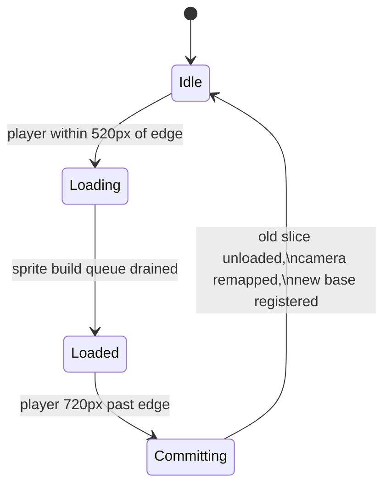

### Object Tagging

Every object created by a region build is tagged `._streamRegion = regionIndex`. On unload, all objects with that tag are destroyed in a single pass:

```javascript
// Unload a completed slice
_unloadSlice(slice) {
  for (const o of slice.objects) o.destroy?.();
  // enemies, NPCs, creatures, noWalk bodies — all filtered by ._streamRegion
}
```

### Portal Gates

Some portals are gated by conditions checked before traversal:

```javascript
const PORTAL_GATES = {
  34: [{ target: 39, requires: { lore: 15 },
    sealedText: 'The Sixth Door is sealed...' }],
};
```

---

## 10. Prop & Collision System

### Classification (`src/data/propTypes.js`)

Every placed sprite is classified by `classifyProp(sp)` which checks the sprite's `name` field first, then its `dir` path:

```
'solid'  → Y-sorted + footprint collider  (trees, rocks, pillars, crates)
'decor'  → Y-sorted, walk-through         (bushes, reeds, shrubs)
'ground' → always under actors, no sort   (grass, flowers, shadows, dirt)
```

Unknown props default to `'decor'`.

### Footprint Collision (`src/data/propFootprints.js`)

Per-asset collision boxes in source-image space, auto-generated by `tools/gen_prop_footprints.py`:

```javascript
"Tiny Swords (Free Pack)/.../Trees/Tree1.png": { cx: 95.5, cy: 231.0, w: 49.3, h: 18 }
```

At runtime, the box is mapped to world space via the sprite's anchor and scale:

```
worldCX = sp.x + (cx - offsetX) * scaleX
worldCY = sp.y + (cy - offsetY) * scaleY
```

Trees get a narrow trunk box at the base (character walks behind canopy); rocks get a body box.

### Depth Sorting

Solid and decor props are placed with a Phaser depth value tied to their Y position (updated each frame for moving entities). Props with Y > player.y are drawn above; props with Y ≤ player.y are drawn below. The sort runs `setDepth()` on every solid/decor sprite per update tick.

### No-Walk Zones

Hand-drawn rectangles from the map editor are loaded as Arcade Physics static bodies. The physics engine then blocks player and enemy movement naturally. Bodies are tagged with `._streamRegion` for lifecycle management.

---

## 11. Creature System

Map-editor regions can place any approved animation entity as a live creature, drawn from `docs/animations.json`.

### Spawn Flow

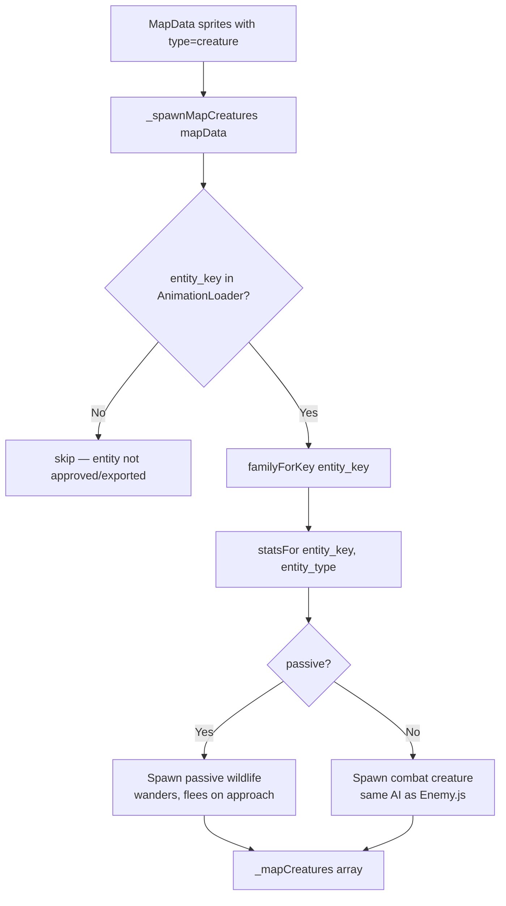

### Directional Facing

Creatures spawn with an initial facing direction seeded from their spawn position (deterministic across host and client in co-op). This means e.g. creatures on the left side of a region face right by default.

### Passive Wildlife AI

Passive creatures (`passive: true` in `creatureStats.js`) never initiate combat:
- **Idle**: wander slowly at 1.5–4s intervals
- **Flee**: when a player enters ~120px, flee at high speed in the opposite direction
- **Flee on hit**: any damage triggers immediate flee regardless of distance
- Still give XP when killed

---

## 12. XP, Leveling & Amrit

### XP System

Every enemy kill emits `enemy_killed` with an `xpValue`. The active local Player calls `gainXP(xpValue)` and compares against `XP_THRESHOLDS[]`. When a threshold is crossed, the player flags `pendingLevels++` and the GameScene emits `level_up_available`.

```javascript
export const XP_THRESHOLDS = [100, 250, 450, 700, 1000, 1350, 1750, 2200, 2700, Infinity];
export const POINTS_PER_LEVEL = 5;
export const POINT_PCT = 5; // +5% per point applied to a stat
```

### ShrineScene

Level-up stat allocation happens at Thread Shrines via the `ShrineScene` overlay:
- Shows pending level count and available stat choices
- Player distributes 5 points per level across maxHp / maxStamina / abilityPow
- Each point is a permanent +5% to the base stat
- Applied immediately to the Player object and persisted to save

### Amrit Flask

```javascript
export const AMRIT_MAX_DEFAULT = 4;     // default charges
export const AMRIT_HEAL_FRAC   = 0.55;  // 55% of maxHp per sip
export const AMRIT_SIP_LOCKOUT = 550;   // ms player is vulnerable while drinking
```

Amrit charges are shown as pips in the UIScene HUD. Charges save on portal/shrine and refill to max on shrine activation or death.

---

## 13. Death Echo

When a player dies, accumulated XP is preserved as a **Death Echo** object at the death location.

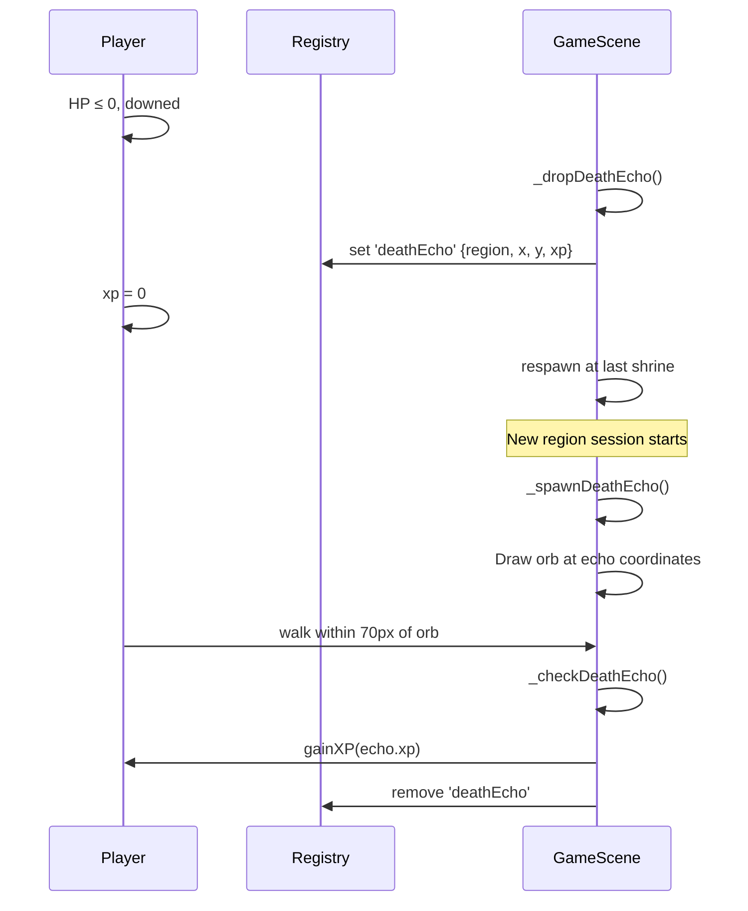

The echo only spawns in the region where the player died (matched by `echo.region === regionIndex`). If the player dies again before reaching the echo, the XP is permanently lost.

---

## 14. World Map & Fog-of-War

### WorldMapScene

A pannable/zoomable scene showing all 50 regions as nodes on a virtual canvas. Launched from the main menu or M key during gameplay.

**Node rendering:**
- **Explored**: shows a screenshot thumbnail (`/api/regions/{index}/screenshot`)
- **Unexplored**: dark grey placeholder with locked icon
- **Current region**: highlighted border

**Edges**: lines between connected regions (derived from portal `targetRegion` fields). Gold if both endpoints explored; dim grey otherwise.

**Fast travel**: clicking an explored node offers fast-travel to that region.

### ExploredManager

```javascript
// Persists to localStorage key 'akhand_explored' as a JSON array of indices
ExploredManager.markExplored(regionIndex)  // called on every GameScene.create()
ExploredManager.isExplored(regionIndex)    // → boolean
ExploredManager.getAll()                   // → Set<number>
ExploredManager.clear()                    // called on new game
```

### Node Layout (`worldMapLayout.js`)

50 nodes positioned on a virtual coordinate system using `P(col, lane)` grid helpers. Acts are colour-coded:

| Act | Colour | Theme |
|---|---|---|
| 1 | Green `0x6bbf4a` | Mortal Vale / Earth |
| 2 | Blue `0x49a6d6` | Drowned Reach / Water |
| 3 | Orange `0xe08a3c` | Emberwastes / Fire |
| 4 | Cyan `0x7fd4e0` | Skyward Climb / Wind |
| 5 | Purple `0x9a6cd0` | Sunless Deep / Underworld |
| 6 | Red `0xc0432f` | The Severance / Void |
| 7 | Gold `0xe8c860` | Erased Path / Secret |

---

## 15. User Flow

### Full Game Flow

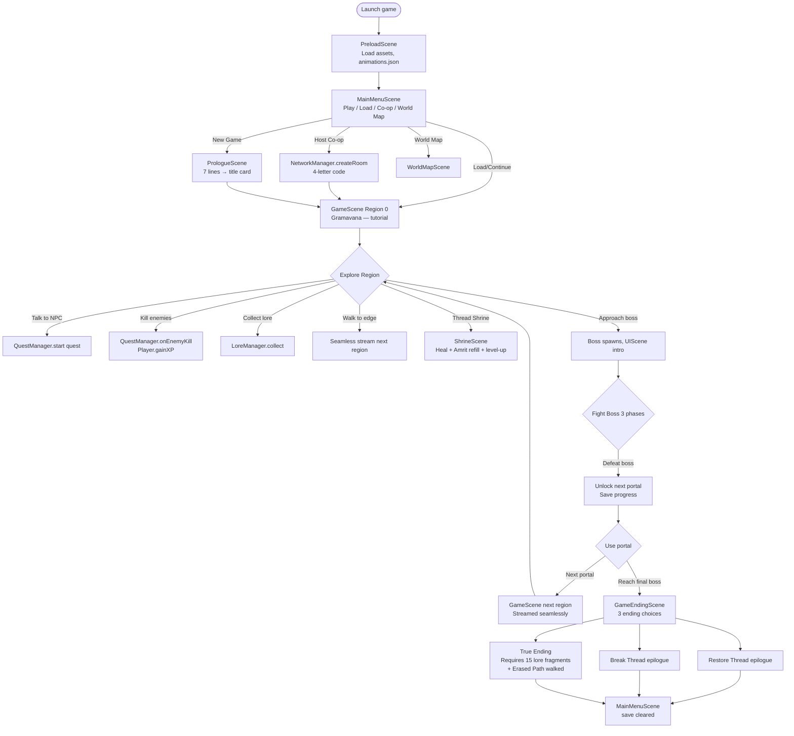

### Death Flow

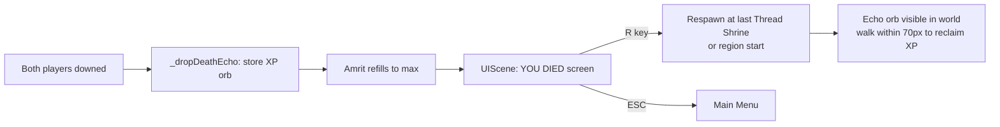

---

## 16. Combat Flow

### Player Attack

```mermaid
sequenceDiagram
    participant Input
    participant Player
    participant Enemy
    participant UIScene
    participant AudioManager

    Input->>Player: J key down (light attack)
    Player->>Player: Check _lightCd ≤ 0, stamina ≥ 12, not dodging
    Player->>Player: stamina -= 12; _lightCd = 500ms
    Player->>Player: _doAttack(LIGHT_DMG=20, hitstop=40ms)
    Player->>Player: Arc detection 130°, 175px range
    loop Each enemy in cone
        Player->>Enemy: takeDamage(damage, player, scene)
        Enemy->>Enemy: Reduce HP; emit enemy_killed if HP ≤ 0
        Enemy->>Player: gainXP(xpValue)
    end
    Player->>AudioManager: audio.hit()
    Player->>Player: Hitstop 40ms
```

---

## 17. Enemy AI

### State Machine

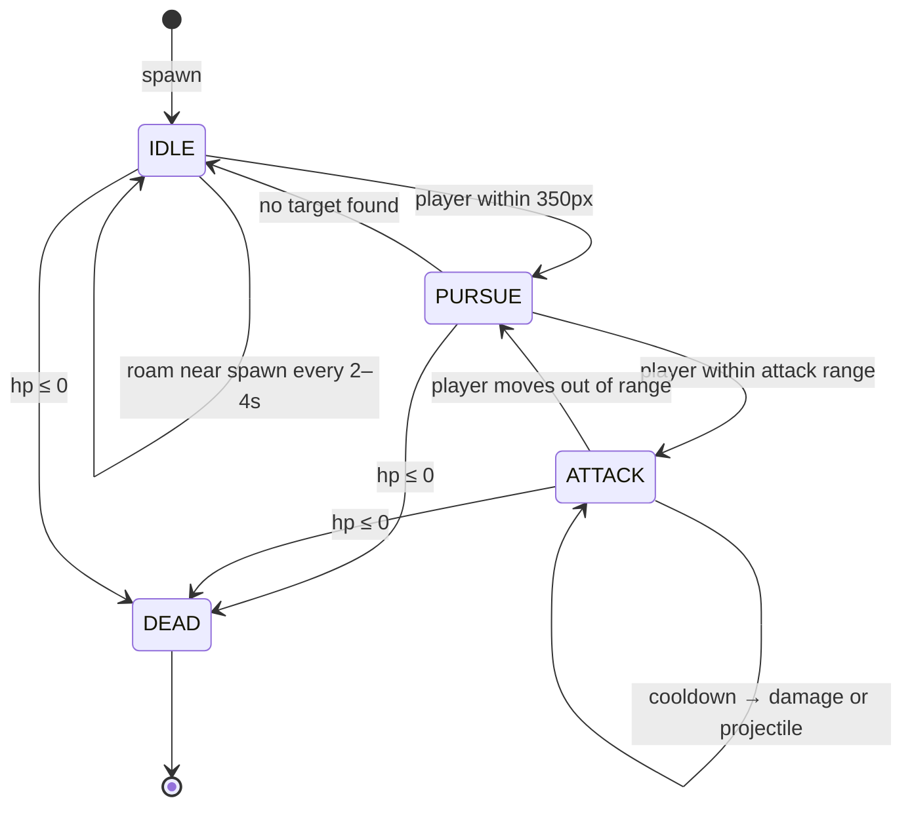

Ranged enemies (Archers) use a cover system: they evaluate nearby tree positions and move toward the one that gives line-of-sight to the player before firing.

---

## 18. Boss System

### Boss State Machine

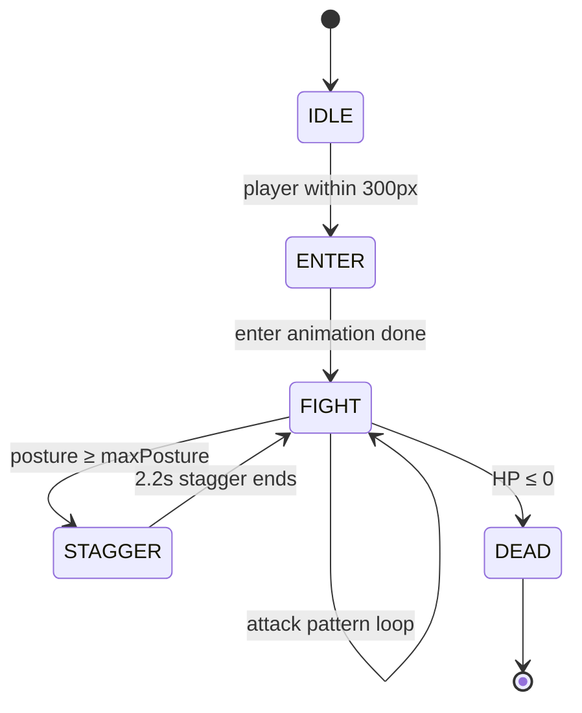

### Posture System

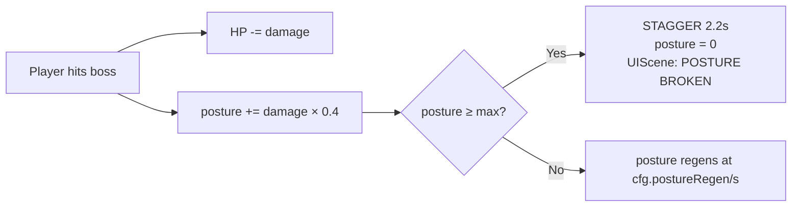

---

## 19. Save & Persistence

### Save Trigger Points

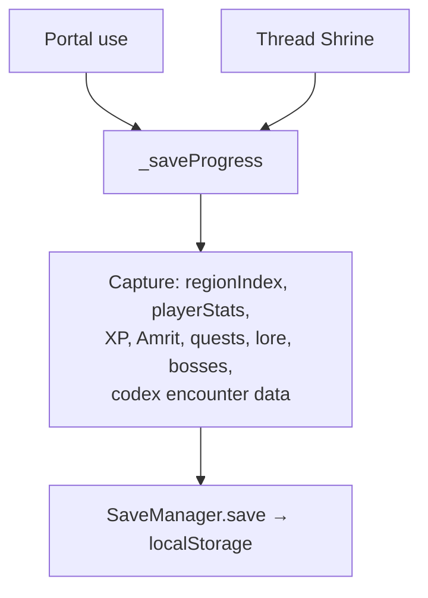

### What Is Saved vs. Not Saved

| Saved | Not Saved |
|---|---|
| Region index | Mid-region enemy positions |
| Player HP/stamina/ability power | Loot on the ground |
| Player XP + pendingLevels | NPC interaction state per session |
| Amrit charges + max | Current spawner wave state |
| Completed quest IDs | Death Echo orb position |
| Collected lore fragment IDs | |
| Boss kill list | |
| Codex: encountered enemies, met NPCs | |

---

## 20. Multiplayer Networking

### Connection Flow

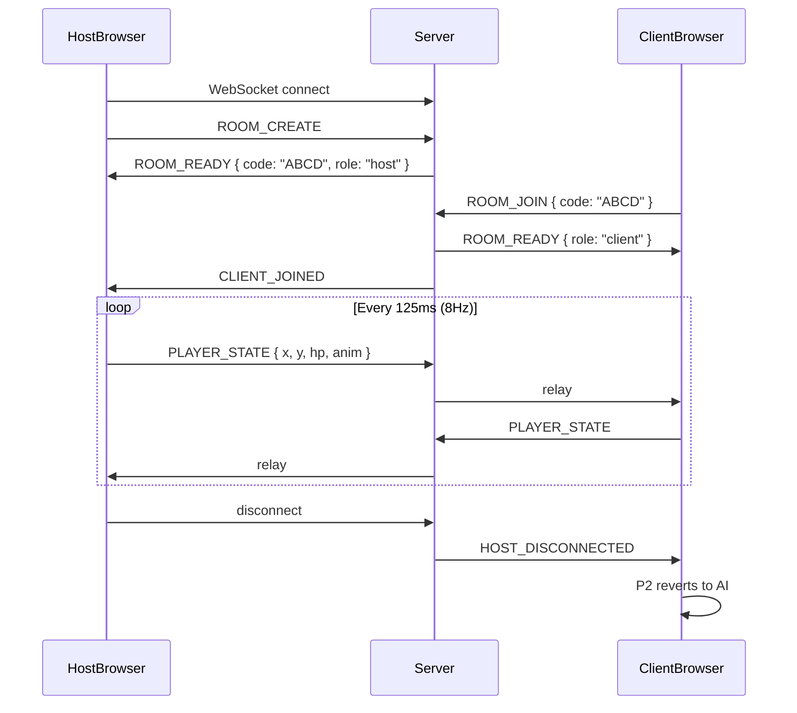

**No server-side simulation** — the server is a relay only. Each player controls their own character locally.

---

## 21. Map Editor

The map editor (`map_editor.html`) uses **Konva.js** and connects to the same Node.js WebSocket server for real-time collaboration.

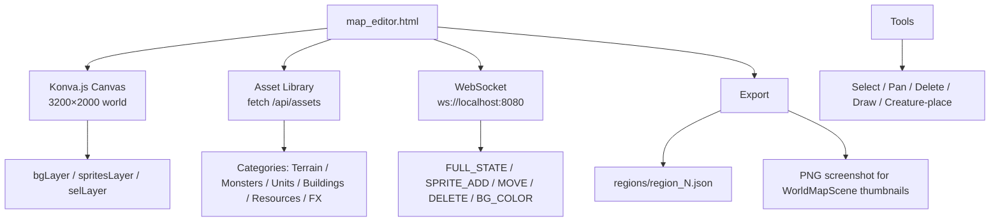

The server exposes `GET /api/assets` (asset manifest) and `GET /api/regions` (all region JSON + metadata) which the WorldMapScene uses to populate node thumbnails and portal edges.

---

## 22. Key Design Decisions

### Why Phaser 3?

Runs in the browser with zero install. Co-op over WebSocket works without a launcher or NAT traversal — players share a URL and a 4-letter room code.

### Why No Build Step?

ES modules loaded directly. Instant dev loop: edit a file, refresh. No webpack, no transpilation. Trade-off: no TypeScript, slightly slower cold load on many small module fetches.

### Why Synthesized Audio?

Web Audio API synthesis = zero audio asset files, no licensing, audio that can dynamically pitch/speed. Trade-off: abstract sounds rather than realistic ones.

### Why localStorage?

Simple, zero-dependency, works offline. Save payload ≈ 2–3 KB. Trade-off: per-browser, not per-account.

### Seamless Streaming vs. Scene Restarts

Originally regions restarted the GameScene on portal use. Streaming eliminates that: regions are built as horizontal slices that load/unload while the scene stays live. The 100-sprites-per-frame build budget prevents frame hitches on low-end hardware.

### Prop Classification Default: 'decor'

Unknown props default to walk-through `decor` instead of `solid`. This ensures new map-editor assets never silently wall off a path — they can only gain blocking once explicitly added to propTypes rules or given a noWalkZone by the map author.

### Posture System

Inspired by Sekiro. Prevents degenerate attack-spam → free stagger. Posture regens between bursts, forcing co-ordinated burst windows during the 2.2s stagger. Rewards co-op coordination.

### 8Hz Network Tick

Co-op is cooperative, not competitive. 125ms latency is imperceptible for "follow your friend" play. Higher tick rates multiply bandwidth for no perceptible benefit.

---

## Summary

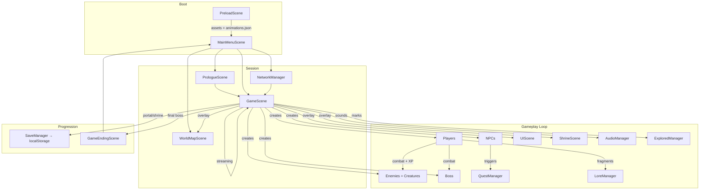

The game is a **single streaming main loop** (GameScene) surrounded by **static authored data** (region JSONs, creatureStats, propTypes), **event-driven UI** (UIScene + WorldMapScene listening on GameScene events), and **side-effect managers** (save, audio, network, quests, XP) called in response to gameplay events.
