# AKHAND SUTRA — World Design: *The Fractured Realm*
### A 36-region open world

> Design document only. No region JSON / code changes are implied by this file — it is the
> planning blueprint for expanding the world from the current regions to a connected 36-region map.

## Design premise (how the geography encodes the lore)

The land of **Akhand** was once *one unbroken continent*, stitched together by the Akhand Sutra — a
literal golden thread that ran through the world like a root-system. When **Viyogasur** "severed" it,
the land didn't just lose its magic — **it physically came apart.** Provinces drifted into islands
divided by chasms, floods, ash-wastes, and tears in reality. To travel now, you cross **fragile
remnant-threads** (the game's portals), broken bridges, ferries, cave tunnels, and sky-stairs.

The world is organized as **6 provinces (Acts) + 1 hidden path**, descending and ascending around a
vertical axis:

```
        SKYWARD CLIMB (Vayu)
              ^
EMBERWASTES -> CROSSROADS <- DROWNED REACH
   (Agni)      (hubs)        (Jal)
              ^v
        MORTAL VALE (start)
              v
   THE SUNLESS DEEP (Patala)  <--secret-->  THE ERASED PATH (Ekatmadeva)
              v
        THE SEVERANCE (Void / finale)
```

The **5 kept regions** anchor the world: Gramavana opens it, Smrtivana (R7) is the first forest,
Shilavana (R9) sits in the water province, the "Nagraj" arena (R8) becomes the serpent-king's court,
and Patala Guha (R10) is the heart of the underworld branch.

---

## The world at a glance

| Act | Province | Element | Regions | Difficulty | Role |
|----|----------|---------|---------|-----------|------|
| I | The Mortal Vale | Prithvi (Earth) | 6 | 0.4–1.1 | Tutorial + first hub |
| II | The Drowned Reach | Jal (Water) | 6 | 1.1–1.8 | Rivers, swamp, serpent boss |
| III | The Emberwastes | Agni (Fire) | 6 | 1.8–2.4 | Desert, volcano, temple boss |
| IV | The Skyward Climb | Vayu (Wind) | 6 | 2.4–3.0 | Mountains, heavens, wind boss |
| V | The Sunless Deep | Patala (Underworld) | 5 | 2.0–3.0 | Optional vertical branch |
| VI | The Severance | Void | 4 | 3.1–3.5 | Finale |
| ✦ | The Erased Path | Ekatmadeva | 3 | 3.0–3.5 | **Secret — true ending** |

**Legend:** 🟢 kept/existing region · ⚔️ boss/mini-boss arena · 🏘️ hub (shops/NPCs/save) ·
🔒 gated · ★ optional side-region · ✦ secret

---

## ACT I — THE MORTAL VALE *(Prithvi · Earth)*

**1. Ash Village — *Gramavana*** 🟢🏘️ *(existing R0)*
- **Biome:** Forest village, peaceful green clearing.
- **Theme:** Earth / home / memory.
- **Terrain & objects:** Huts with gates, sacred pressure plates, well, ash-stained shrine, rabbits.
- **Inhabitants:** Elder Mahesh, village healer, child, villagers. No boss.
- **Lore role:** Establishes the severed-thread tragedy; Mahesh's first fragment hints "the temples once had six halos."
- **Gating:** Open (start). Exit unlocks after talking to Mahesh.
- **Difficulty:** 0.4

**2. Memory Grove — *Smrtivana*** 🟢 *(existing R7)*
- **Biome:** Dense green forest with mossy rocks (its current look).
- **Theme:** Earth / the forest that "remembers" the old world.
- **Terrain & objects:** Tall canopy trees, rock clusters, fallen logs, a thread-shrine where a frayed golden strand still hums.
- **Inhabitants:** Forest Raksha (melee), Shadara Archers; NPC **Hermit Veda** (relocated here).
- **Lore role:** Veda explains the Sutra and that "one name was scraped from the bark of every tree here."
- **Gating:** Open from Gramavana.
- **Difficulty:** 0.6

**3. Withered Fields — *Dhanyakshetra*** ★
- **Biome:** Abandoned terraced farmland gone to rot.
- **Theme:** Earth / decay, the cost of severance on ordinary people.
- **Terrain & objects:** Dead crop rows, scarecrows, broken irrigation channels, a ruined granary.
- **Inhabitants:** Scarecrow-husk enemies (reskinned melee), field rats. Optional mini-boss: **Kshetrapala, the Withered Warden**.
- **Lore role:** A side fragment: famine began "the day the sixth blessing stopped coming."
- **Gating:** Optional spur off Setubandha.
- **Difficulty:** 0.7

**4. Broken Bridge — *Setubandha*** 🏘️🔒
- **Biome:** Stone trade-town perched at the lip of the first great chasm.
- **Theme:** Earth / the first visible "severance wound" — a colossal broken bridge.
- **Terrain & objects:** Market stalls, merchant huts, the shattered bridge spanning a bottomless rift, a winch-lift down into the Deep.
- **Inhabitants:** Merchant, scholar, ferry-broker NPCs. No boss (central **hub**).
- **Lore role:** Crossroads of the early game; rumor-NPCs seed every later province. The lift here is the entrance to **Act V (The Sunless Deep)**.
- **Gating:** **Hub.** Forward bridge to Pasanadvara is broken until you retrieve the **Stone Key** from Mrgavana *or* Dhanyakshetra.
- **Difficulty:** 0.8

**5. Hunter's Thicket — *Mrgavana*** ★
- **Biome:** Wild tangled woods, darker than Smrtivana.
- **Theme:** Earth / untamed nature.
- **Terrain & objects:** Thornbrush, hunter's blinds, bone-piles, a poacher's camp.
- **Inhabitants:** Beast enemies (bats, wolves-reskin), elite **Ogre** poacher. Holds the **Stone Key**.
- **Lore role:** A hunter NPC saw "a kneeling god in a vision" — minor fragment.
- **Gating:** Optional, off Setubandha; one of two Stone Key sources.
- **Difficulty:** 0.9

**6. Stone Gate — *Pasanadvara*** ⚔️🔒
- **Biome:** Narrow mountain pass between cliff walls.
- **Theme:** Earth / threshold out of the homeland.
- **Terrain & objects:** Carved gate pillars, rockslide debris, a toll-shrine.
- **Inhabitants:** Stone sentinels; **mini-boss: Dvarapala, the Gatekeeper** (stone golem, reuses `mino` art).
- **Lore role:** The gate's carvings show *five* gods where there are clearly *six* niches.
- **Gating:** Critical path; opens with Stone Key. Boss unlocks Act II.
- **Difficulty:** 1.1

---

## ACT II — THE DROWNED REACH *(Jal · Water)*

**7. Sunken Road — *Plavita***
- **Biome:** A drowned road, half-submerged, knee-deep water and reeds.
- **Theme:** Water / the land literally sinking.
- **Terrain & objects:** Flooded pavement, reed beds, tilted statues, lily pads.
- **Inhabitants:** Drowned-husk melee, water-slimes (slime art, blue tint).
- **Lore role:** Submerged murals visible through the water — the sixth halo "washed clean."
- **Gating:** Critical path from Pasanadvara.
- **Difficulty:** 1.2

**8. Ferry Village — *Naditira*** 🏘️
- **Biome:** Riverside stilt-village on a wide delta.
- **Theme:** Water / commerce and crossing.
- **Terrain & objects:** Docks, stilt-huts, moored boats, fish-drying racks, pressure-plate shrine.
- **Inhabitants:** Ferryman, fishmonger, healer NPCs. **Hub.**
- **Lore role:** The ferryman routes you to optional islands (Kardama, Shilavana). Tells of "a god who paid the ferry for every soul, until they erased his coin."
- **Gating:** **Hub** branching to side-regions and the serpent path.
- **Difficulty:** 1.3

**9. Whisper Mire — *Kardama*** ★
- **Biome:** Fetid swamp, fog, poison pools.
- **Theme:** Water / corruption, things that should stay sunk.
- **Terrain & objects:** Mangrove roots, bubbling poison, witch-light, a half-sunk shrine.
- **Inhabitants:** Mimics in the muck, poison-spitter ranged. Optional mini-boss: **Pankaja, the Bog Mother**.
- **Lore role:** A hidden lore fragment whispered by the bog itself.
- **Gating:** Optional, via ferry.
- **Difficulty:** 1.4

**10. Stone Vale — *Shilavana*** 🟢★ *(existing R9)*
- **Biome:** Stony river-valley, scattered boulders, a clear stream (its current look).
- **Theme:** Water + Earth boundary; a calm respite.
- **Terrain & objects:** Standing stones, river, sheep, sparse trees (its existing cropped assets).
- **Inhabitants:** Light enemies, a wandering sage NPC; sheep ambience.
- **Lore role:** A quiet region — a stone circle here is the only place the sixth god's *symbol* survives intact; rubbing it gives a fragment.
- **Gating:** Optional, off the ferry (Naditira). A peaceful breather between fights.
- **Difficulty:** 1.5

**11. Serpent Marsh — *Nagakshetra*** 🔒
- **Biome:** Brackish marsh of coiling channels, serpent territory.
- **Theme:** Water / the Naga domain.
- **Terrain & objects:** Snake-carved totems, amber pools, petrified trees, shed skins.
- **Inhabitants:** Naga acolyte enemies, venom-archers.
- **Lore role:** The Naga remember the erased god as their lost patron — they guard his name.
- **Gating:** Critical path; opens after you bring the **Naga Token** (from Kardama or a ferry quest).
- **Difficulty:** 1.6

**12. Serpent Court — *Nagaraja Sabha*** 🟢⚔️ *(existing R8, "Test Boss Nagraj")*
- **Biome:** Sunken serpent throne-hall, green-lit.
- **Theme:** Water / serpent royalty.
- **Terrain & objects:** Coiled-pillar columns, a flooded throne, votive snakes.
- **Inhabitants:** **Boss: Nagraja Kaliya** (multi-headed serpent king).
- **Lore role:** Kaliya, dying, confesses the gods' conspiracy — a major fragment. Unlocks Act III.
- **Gating:** Critical path boss arena (repurpose the existing test arena).
- **Difficulty:** 1.8

---

## ACT III — THE EMBERWASTES *(Agni · Fire)*

**13. Ash Flats — *Bhasmabhumi***
- **Biome:** Endless grey ash plain, scorched.
- **Theme:** Fire / aftermath of a divine burning.
- **Terrain & objects:** Ash dunes, charred trees, smoking fissures, bone markers.
- **Inhabitants:** Ash-wraith ranged, ember-slimes.
- **Lore role:** This is where the gods *burned* the sixth god's temples; ash never settles.
- **Gating:** Critical path from the serpent court.
- **Difficulty:** 1.9

**14. Copper Bazaar — *Tamrapura*** 🏘️
- **Biome:** Sandstone desert trade-city, copper domes.
- **Theme:** Fire / desert civilization.
- **Terrain & objects:** Bazaar tents, copper rooftops, a great furnace-forge, cistern shrine.
- **Inhabitants:** Smith, relic-dealer, water-seller NPCs. **Hub.**
- **Lore role:** The relic-dealer sells (and the smith authenticates) **lore-fragment relics**; one is a coin bearing the erased god's face.
- **Gating:** **Hub** for Act III; branches to Marusthala.
- **Difficulty:** 2.0

**15. Glass Desert — *Marusthala*** ★
- **Biome:** Open dunes fused to glass by old fire; mirages.
- **Theme:** Fire / illusion and thirst.
- **Terrain & objects:** Glass spires, mirage-pools, a buried caravan, sun-bleached idol.
- **Inhabitants:** Mirage-doppelganger enemies, scorpion-reskins. Optional mini-boss: **Mrgatrshna, the Mirage**.
- **Lore role:** A mirage replays the erasure ceremony — optional fragment.
- **Gating:** Optional, off Tamrapura.
- **Difficulty:** 2.1

**16. Fire Caldera — *Agnikunda*** 🔒
- **Biome:** Active volcanic caldera, lava channels.
- **Theme:** Fire / the forge of the gods.
- **Terrain & objects:** Lava flows, basalt bridges, ember geysers, an anvil-altar.
- **Inhabitants:** Fire-elementals, magma-golems (mino reskin).
- **Lore role:** The weapons used against the sixth god were forged here.
- **Gating:** Critical path; needs **Heatward Charm** from Tamrapura.
- **Difficulty:** 2.2

**17. Temple of Gods — *Deva Mandira*** 🔒
- **Biome:** Grand golden fire-temple complex.
- **Theme:** Fire / divine authority (the conspirators' seat).
- **Terrain & objects:** Gold pillars, eternal braziers, the **Great Mural** (six halos, one scraped away), priest-cells.
- **Inhabitants:** Temple guardians, priest NPCs who lie about the history.
- **Lore role:** The pivotal region — the Great Mural is the clearest proof of the erasure. Central fragment.
- **Gating:** Critical path.
- **Difficulty:** 2.3

**18. Demon Forge — *Pasana Daitya*** ⚔️
- **Biome:** Inner forge-sanctum, molten and stone.
- **Theme:** Fire + Earth.
- **Terrain & objects:** Bellows, slag heaps, a half-finished colossus.
- **Inhabitants:** **Boss: Pasana Daitya** (stone-and-fire demon, `mino` art).
- **Lore role:** The Daitya was *built* to guard the lie; defeating it cracks the temple's authority. Unlocks Act IV.
- **Gating:** Critical path boss.
- **Difficulty:** 2.4

---

## ACT IV — THE SKYWARD CLIMB *(Vayu · Wind)*

**19. Cloud Stair — *Meghasopana***
- **Biome:** Floating stone stairs rising into cloudbanks.
- **Theme:** Wind / ascent.
- **Terrain & objects:** Broken sky-stairs, drifting platforms, prayer-bells, updraft vents.
- **Inhabitants:** Wind-wisps, gust-archers.
- **Lore role:** The climb toward the gods who "ascended above judgment."
- **Gating:** Critical path from the forge.
- **Difficulty:** 2.5

**20. Wind Cliffs — *Vayupatha*** 🔒
- **Biome:** Sheer cliffs lashed by crosswinds.
- **Theme:** Wind / peril.
- **Terrain & objects:** Narrow ledges, rope-bridges, gust-zones that shove the player.
- **Inhabitants:** Harpy-reskin flyers, cliff-lurkers.
- **Lore role:** Carved into the cliff: a falling figure — the sixth god cast down.
- **Gating:** Critical path; wind-gusts require **Anchor Stone** (from Garudalaya quest) for the hardest ledges.
- **Difficulty:** 2.6

**21. The Eyrie — *Garudalaya*** 🏘️
- **Biome:** Cliff-top sanctuary of the bird-folk.
- **Theme:** Wind / refuge above the world.
- **Terrain & objects:** Nest-towers, wind-shrines, a great roost, pressure-plate shrine.
- **Inhabitants:** Garuda-kin NPCs (loremasters), healer. **Hub.**
- **Lore role:** The bird-folk kept *uncensored* records; here you can learn the sixth god's true name **Ekatmadeva** if you've gathered enough fragments. Branches to Himashikhara.
- **Gating:** **Hub.**
- **Difficulty:** 2.7

**22. Frostpeak — *Himashikhara*** ★
- **Biome:** Snow-capped summit, blizzard.
- **Theme:** Wind + ice / isolation.
- **Terrain & objects:** Snowdrifts, ice shrines, a frozen pilgrim, frost-crystals.
- **Inhabitants:** Frost-guardians (Frost_Guardian art). Optional mini-boss: **Tushara, the Frozen Pilgrim**.
- **Lore role:** A pilgrim froze mid-prayer to the erased god — optional fragment.
- **Gating:** Optional, off Garudalaya.
- **Difficulty:** 2.8

**23. Heaven's Edge — *Swarga Seema*** 🔒
- **Biome:** Pale sky-blue heaven-rim, palace clouds.
- **Theme:** Wind / the gods' threshold.
- **Terrain & objects:** Cloud terraces, heavenly gates, apsara fountains.
- **Inhabitants:** Deva sentinels, apsara NPC.
- **Lore role:** The seat of the five gods who remain — the conspiracy's penthouse.
- **Gating:** Critical path; needs Ekatmadeva's name learned at Garudalaya.
- **Difficulty:** 2.9

**24. Storm's Eye — *Vayu Rakshasa*** ⚔️
- **Biome:** Eye of a perpetual sky-storm.
- **Theme:** Wind.
- **Terrain & objects:** Spinning debris-rings, lightning, a torn banner of six gods.
- **Inhabitants:** **Boss: Vayu Rakshasa** (wind demon, frost/cyan art).
- **Lore role:** The last guardian of heaven's lie; falling, it points you "down, to where they buried him." Opens the route to the Severance **and** reveals the Sunless Deep's true purpose.
- **Gating:** Critical path boss.
- **Difficulty:** 3.0

---

## ACT V — THE SUNLESS DEEP *(Patala · Underworld)* — *optional vertical branch*

> Reachable early via the lift at **Setubandha** (Act I) and again from **Asthinagara**. Optional for
> the normal ending, **required for the true ending.**

**25. Blind Well — *Andhakupa***
- **Biome:** A vast vertical shaft descending into darkness.
- **Theme:** Underworld / descent.
- **Terrain & objects:** Spiral ledges, dripping roots, lantern-hooks, a creaking lift.
- **Inhabitants:** Cave bats, blind crawlers.
- **Lore role:** The well was dug to *bury* something the gods wanted gone.
- **Gating:** Entrance from Setubandha's lift.
- **Difficulty:** 2.0

**26. Gem Hollows — *Ratnaguha*** ★
- **Biome:** Crystal caverns, faint glow.
- **Theme:** Underworld / hidden wealth and truth.
- **Terrain & objects:** Gem clusters, underground pools, mining ruins.
- **Inhabitants:** Crystal-slimes, gem-mimics; a lost miner NPC.
- **Lore role:** Gems here "hold light from before the severing."
- **Gating:** Optional spur.
- **Difficulty:** 2.4

**27. Sunless Deep — *Patala Guha*** 🟢 *(existing R10)*
- **Biome:** Torch-lit crystal cave with a black underground lake (its current look).
- **Theme:** Underworld / the deep heart.
- **Terrain & objects:** Crystal pillars, torches, the still black lake, rock chambers (its existing assets).
- **Inhabitants:** Deep-dwellers, cave bats; a hermit who never left.
- **Lore role:** The hermit tends a shrine to a god "no one else remembers" — strong fragment.
- **Gating:** Critical to the Deep branch.
- **Difficulty:** 2.6

**28. Bone City — *Asthinagara*** 🔒
- **Biome:** A buried ancient city of pale bone-stone.
- **Theme:** Underworld / the dead who remember.
- **Terrain & objects:** Bone arches, ossuary towers, a sunken plaza, ancestor-shrines.
- **Inhabitants:** Skeletal wardens, a council of shade-NPCs.
- **Lore role:** The dead testify to the erasure unfiltered; a shortcut tunnel rises into **Chidrabhumi (Act VI)**.
- **Gating:** Needs **Bone Sigil** from Ratnaguha.
- **Difficulty:** 2.8

**29. Forgotten Well — *Vismrti Kupa*** ✦🔒
- **Biome:** A drowned vault at the world's bottom, utterly silent.
- **Theme:** Underworld / oblivion itself.
- **Terrain & objects:** Submerged archives, a black mirror-pool, a sealed sixth door.
- **Inhabitants:** Memory-wraiths; the **Voice in the Void** NPC.
- **Lore role:** Where the gods drowned every record of Ekatmadeva. **Gateway to the Erased Path** — the sealed door opens only when all lore fragments are collected.
- **Gating:** Critical to the Deep; gates the secret act.
- **Difficulty:** 3.0

---

## ACT VI — THE SEVERANCE *(Void · finale)*

**30. Torn Land — *Chidrabhumi***
- **Biome:** Reality fractured into floating shards over a void.
- **Theme:** Void / the wound itself.
- **Terrain & objects:** Drifting land-shards, snapped golden threads, gravity tears.
- **Inhabitants:** Void-husks, severed-soul wraiths.
- **Lore role:** You walk the actual severance scar. Connects to Asthinagara (from below) and Vayu's Tempest (from above).
- **Gating:** Critical path convergence point.
- **Difficulty:** 3.1

**31. The Between — *Antarala*** 🏘️
- **Biome:** A still grey limbo, a last island of calm.
- **Theme:** Void / the pause before the end.
- **Terrain & objects:** A single shrine, a campfire, the frayed end of the Sutra.
- **Inhabitants:** No enemies — a final NPC reckoning (Dhruva/Tara reflect). **Last hub/save.**
- **Lore role:** Last chance to gather missed lore / commit to the true path.
- **Gating:** **Hub** before finale.
- **Difficulty:** 3.2

**32. Severance Fortress — *Viyoga Durga*** 🔒
- **Biome:** Black-purple void fortress, dark overlay.
- **Theme:** Void.
- **Terrain & objects:** Obsidian ramparts, broken thread-bridges, judgment thrones.
- **Inhabitants:** Elite void-guard, the **Voice in the Void**.
- **Lore role:** Viyogasur's seat — and the prison where the gods chained the "Demon of Separation" who was never a demon.
- **Gating:** Critical path.
- **Difficulty:** 3.4

**33. The Severing — *Sutracheda*** ⚔️
- **Biome:** The exact point where the thread was cut, a void-altar.
- **Theme:** Void / truth.
- **Terrain & objects:** The severed Sutra's two ends, a cosmic loom, six thrones (one empty).
- **Inhabitants:** **Final Boss: Viyogasur.**
- **Lore role:** The confrontation. Normal ending = restore or break the thread. **If you walked the Erased Path, a third option appears.**
- **Gating:** Final boss arena.
- **Difficulty:** 3.5

---

## ✦ THE ERASED PATH *(Ekatmadeva · secret · true ending)*

> Unlocks **only** with all lore fragments collected, via the sealed door in **Vismrti Kupa (R29)**.

**34. Sixth Gate — *Shashtha Dvara*** ✦🔒
- **Biome:** A radiant doorway that "shouldn't exist," gold against the dark.
- **Theme:** The restored sixth element — *Atman* (soul).
- **Terrain & objects:** A gate of living thread, names re-appearing on the walls as you pass.
- **Inhabitants:** Guardians of memory (non-hostile if you know the name).
- **Lore role:** Crossing it restores Ekatmadeva to the world's records.
- **Gating:** All lore fragments.
- **Difficulty:** 3.0

**35. Soul Sanctum — *Ekatmalaya*** ✦
- **Biome:** Ekatmadeva's erased temple, rebuilt by your remembering — warm gold, whole.
- **Theme:** Wholeness / the unbroken thread as it was.
- **Terrain & objects:** Six intact halos, an unbroken Sutra, a living tree at the center.
- **Inhabitants:** The presence of **Ekatmadeva**; the **true** account of the conspiracy.
- **Lore role:** You learn Viyogasur and Ekatmadeva's real relationship — the key to the third ending.
- **Gating:** Past the Sixth Gate.
- **Difficulty:** 3.5

**36. Silent Shrine — *Maunamandira*** ✦★
- **Biome:** A tiny hidden shrine outside time, reachable only from Ekatmalaya.
- **Theme:** Reflection / epilogue.
- **Terrain & objects:** A single candle, two seats, the whole thread coiled at rest.
- **Inhabitants:** None — a quiet epilogue beat.
- **Lore role:** The final fragment that lets you *reweave* the thread from true history (Epilogue C). The game's emotional resolution.
- **Gating:** Secret, post-Ekatmalaya.
- **Difficulty:** — (no combat)

---

## World-connectivity diagram

```mermaid
graph TD
    %% ===== ACT I — MORTAL VALE =====
    R0["🟢 0 · Ash Village<br/>(Gramavana)"]
    R7["🟢 2 · Memory Grove<br/>(Smrtivana)"]
    R3["★ 3 · Withered Fields<br/>(Dhanyakshetra)"]
    R4["🏘️ 4 · Broken Bridge<br/>(Setubandha · HUB)"]
    R5["★ 5 · Hunter's Thicket<br/>(Mrgavana)"]
    R6["⚔️ 6 · Stone Gate<br/>(Pasanadvara)"]

    %% ===== ACT II — DROWNED REACH =====
    R8["7 · Sunken Road<br/>(Plavita)"]
    R9h["🏘️ 8 · Ferry Village<br/>(Naditira · HUB)"]
    R10["★ 9 · Whisper Mire<br/>(Kardama)"]
    R9k["🟢★ 10 · Stone Vale<br/>(Shilavana)"]
    R11["11 · Serpent Marsh<br/>(Nagakshetra)"]
    R12["🟢⚔️ 12 · Serpent Court<br/>(Nagaraja Sabha)"]

    %% ===== ACT III — EMBERWASTES =====
    R13["13 · Ash Flats<br/>(Bhasmabhumi)"]
    R14["🏘️ 14 · Copper Bazaar<br/>(Tamrapura · HUB)"]
    R15["★ 15 · Glass Desert<br/>(Marusthala)"]
    R16["16 · Fire Caldera<br/>(Agnikunda)"]
    R17["17 · Temple of Gods<br/>(Deva Mandira)"]
    R18["⚔️ 18 · Demon Forge<br/>(Pasana Daitya)"]

    %% ===== ACT IV — SKYWARD CLIMB =====
    R19["19 · Cloud Stair<br/>(Meghasopana)"]
    R20["20 · Wind Cliffs<br/>(Vayupatha)"]
    R21["🏘️ 21 · The Eyrie<br/>(Garudalaya · HUB)"]
    R22["★ 22 · Frostpeak<br/>(Himashikhara)"]
    R23["23 · Heaven's Edge<br/>(Swarga Seema)"]
    R24["⚔️ 24 · Storm's Eye<br/>(Vayu Rakshasa)"]

    %% ===== ACT V — SUNLESS DEEP =====
    R25["25 · Blind Well<br/>(Andhakupa)"]
    R26["★ 26 · Gem Hollows<br/>(Ratnaguha)"]
    R27["🟢 27 · Sunless Deep<br/>(Patala Guha)"]
    R28["28 · Bone City<br/>(Asthinagara)"]
    R29["✦ 29 · Forgotten Well<br/>(Vismrti Kupa)"]

    %% ===== ACT VI — SEVERANCE =====
    R30["30 · Torn Land<br/>(Chidrabhumi)"]
    R31["🏘️ 31 · The Between<br/>(Antarala · last save)"]
    R32["32 · Severance Fortress<br/>(Viyoga Durga)"]
    R33["⚔️ 33 · The Severing<br/>(Sutracheda · FINAL BOSS)"]

    %% ===== HIDDEN — ERASED PATH =====
    R34["✦ 34 · Sixth Gate<br/>(Shashtha Dvara)"]
    R35["✦ 35 · Soul Sanctum<br/>(Ekatmalaya)"]
    R36["✦ 36 · Silent Shrine<br/>(Maunamandira)"]

    %% ---- CRITICAL PATH (solid) ----
    R0 --> R7 --> R4
    R4 ==>|Stone Key 🔒| R6
    R6 ==> R8 --> R9h
    R9h ==>|Naga Token 🔒| R11 --> R12
    R12 ==> R13 --> R14
    R14 ==>|Heatward Charm 🔒| R16 --> R17 --> R18
    R18 ==> R19 --> R20 --> R21
    R21 ==>|Ekatmadeva's name 🔒| R23 --> R24
    R24 ==> R30 --> R31 --> R32 --> R33

    %% ---- OPTIONAL SIDE BRANCHES (dashed) ----
    R4 -.-> R3
    R4 -.-> R5
    R3 -. Stone Key .-> R4
    R5 -. Stone Key .-> R4
    R9h -.-> R10
    R9h -.-> R9k
    R10 -. Naga Token .-> R11
    R14 -.-> R15
    R21 -.-> R22

    %% ---- THE SUNLESS DEEP (vertical branch) ----
    R4 -. lift down .-> R25
    R25 --> R26 --> R27 --> R28
    R28 -. Bone Sigil .-> R29
    R28 -. tunnel up .-> R30
    R24 -. "buried below" .-> R25

    %% ---- THE ERASED PATH (secret) ----
    R29 -. "ALL lore 🔒✦" .-> R34
    R34 --> R35 --> R36
    R36 -. "true ending" .-> R33

    classDef kept fill:#2d5c28,stroke:#7CFC00,color:#fff;
    classDef boss fill:#5c1a1a,stroke:#ff6b6b,color:#fff;
    classDef hub fill:#1a3a5c,stroke:#6bb6ff,color:#fff;
    classDef secret fill:#4a3a1a,stroke:#ffd700,color:#fff;
    class R0,R7,R9k,R27 kept;
    class R6,R12,R18,R24,R33 boss;
    class R4,R9h,R14,R21,R31 hub;
    class R29,R34,R35,R36 secret;
```



**How to read it:** thick `==>` arrows are the **critical path** (Gramavana → final boss). Thin
`-->` are normal walkable connections. Dashed `-.->` are **optional** branches and gated edges (the
label names the key/condition). The **Sunless Deep** hangs vertically off Setubandha and re-joins at
the Torn Land — a full optional loop. The **Erased Path** (gold) is sealed until every lore fragment
is collected.

**Open-world feel comes from:** 5 hubs that fan out to optional regions, the Deep being a parallel
descent you can dip into early and exit late, two ways to reach the finale (down from heaven *or* up
from the bone-city), and gated keys that send you back to earlier hubs — so the world loops instead
of running in a straight line.

---

## Asset wishlist

**Already covered by existing packs** (no sourcing needed):
- Forest/grove/stone regions → *Tiny Swords* terrain + *craftpix tree pack* + the `cropped/` set (R0, R7, R9 proven).
- Caves/crystals → already built in R10 (*Tiny Swords* rocks scaled up + torches).
- Bosses → `assest2`: demon-slime (Viyogasur), Frost_Guardian (Vayu Rakshasa), mino (Pasana/golems), orc/ogre/goblin (elites).
- Monsters/VFX → `assets3`: bat, slime, mimic, rat + vfx (fire, frost, lightning, smoke).
- Map objects/props → `assest4` (map_objects, next2).

**New assets worth sourcing** (flagged — to be integrated when found):

| Need | For regions | Suggested search |
|------|-------------|------------------|
| **Water / swamp / marsh tileset** (shorelines, reeds, lily pads, poison pools) | Act II (7–12) | "pixel art water swamp tileset top-down" / CraftPix swamp |
| **Desert + volcanic tileset** (dunes, glass, lava, basalt) | Act III (13–18) | "pixel art desert lava tileset" / CraftPix fire biome |
| **Sky / cloud platforms** (floating stone, cloud terraces, updrafts) | Act IV (19, 23) | "pixel art sky islands cloud platform" |
| **Snow / ice tileset** | Himashikhara (22) | "pixel art snow tileset top-down" |
| **Bone / ossuary props** (bone arches, skulls, ossuary towers) | Asthinagara (28) | "pixel art bone catacomb tileset" |
| **Ruined temple / golden temple props** (pillars, braziers, murals) | Deva Mandira (17), Swarga (23) | "pixel art temple ruins pixel asset" |
| **Void / cosmic shards** (floating fractured land, star-rifts, thread VFX) | Act VI (30–33) | "pixel art void cosmic platform" |
| **Golden-thread VFX** (the Sutra) | world-wide motif, finale | could synthesize with existing line/stroke rendering |
| **Scarecrow / harpy / serpent-naga enemy sprites** (optional flavor) | R3, R20, R11 | CraftPix enemy packs |

The **golden thread** is the priority motif to source/animate — it appears in nearly every region
(frayed, severed, restored) and visually ties the whole world to the lore.

---

## Open design decisions (to confirm before implementation)

1. **Regions 7 & 8 are redesigned, not just renamed** — R7 → *Smrtivana* (early forest), R8 →
   *Nagaraja Sabha* (serpent boss court). Could instead stay closer to their current state.
2. **The Sunless Deep is optional** but required for the true ending — the main open-world hook. Could
   be moved onto the critical path instead.
3. **Region count is 36** (target was 30–40). Can trim toward 30 or expand toward 40.
